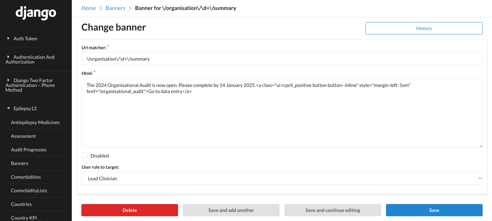

## Site banners

Banners can be added to any page that is not in the guidance.

Banners are created in the Django admin.




`Url matcher` is a [regular expression](https://docs.python.org/3/howto/regex.html) that will be
applied when the page is loaded to decide whether to render a given banner.

For example, to show the banner on the organisation summary:

```
\/organisation\/\d+\/summary
```

The `\d+` matches any organisation ID in the URL

Or to show the banner on the org audit page for a local health board *or* trust:

```
(/trust/\d+/audit)|(/local_health_board/\d+/audit)
```

You can then enter arbitrary HTML that will appear on the page. This can include hyperlinks, `strong` tags etc.

The `disabled` flag is used to retain the banner definition but not display it on the page.
This is helpful so we don't have to recreate the regular expressions each time.

`User role to target` is used to only show the banner to particular users based on role. For example
the call to action to complete the Organisational Audit should only be shown to Lead Clinicians.

RCPCH audit team members always see banners.
