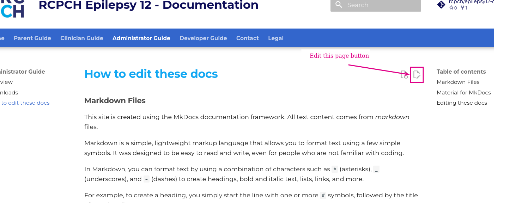
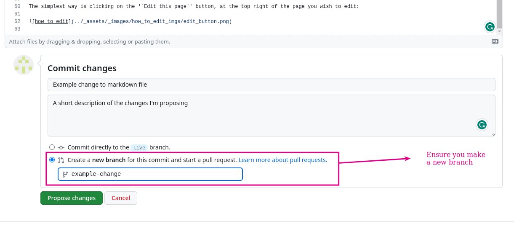

## Markdown Files

This site is created using the MkDocs documentation framework. All text content comes from *markdown* files.

Markdown is a simple, lightweight markup language that allows you to format text using a few simple symbols. It was designed to be easy to read and write, even for people unfamiliar with coding.

In Markdown, you can format text by using a combination of characters such as `*` (asterisks), `_` (underscores), and `-` (dashes) to create headings, bold and italic text, lists, links, and more.

For example, to create a heading, you start the line with one or more `#` symbols, followed by the title of your heading. 

For example:

```markdown
# This is a level 1 heading

## This is a level 2 heading

### This is a level 3 heading
```

To create a list, you can use a `*` or `-` symbol followed by the item you want to list. For example:

```markdown
- Item 1
- Item 2
- Item 3
```

You can also create ordered lists by using numbers:

```markdown
1. First item
2. Second item
3. Third item
```

Markdown also allows you to add links and images to your text using a simple syntax:

```markdown
[Link text](URL)


```

Markdown is widely used on the web, especially in blogs, documentation, and forums. It's a great way to format your text without learning complex HTML or other markup languages.

## Material for MkDocs

On top of MkDocs, this site uses the '*Material for MkDocs*' theme, which adds several extra features and a more modern appearance. In addition, we use the *Material for MkDocs Insiders* edition, allowing us to support the project whilst getting a few neat early-access features.

As you’d expect, there is delightful documentation for both projects: [Material for MkDocs](https://squidfunk.github.io/mkdocs-material/), and for the underlying [MkDocs](https://www.mkdocs.org/), on which it’s built. At times, you may need to refer to both for different features.

## Editing these docs

The simplest way is clicking on the '`Edit this page`' button at the top right of the page you wish to edit:



You will be taken to the edit page on GitHub.

### GitHub Edit Page

Again, click on the edit button near the top right:


### Make your edits

Make any changes you wish to suggest on this page. You can see a preview of the output markdown using the 'Preview' button (*note: Material for MkDocs' flavour of markdown is slightly different to GitHub's, so it may not appear perfectly.*)

Once done, scroll to the bottom of the file. Here, you will submit the proposal for your change:



- Enter a suitable title and description for your proposal, so one of the developers can quickly understand its purpose.

!!!warning "Make a new branch"
    Make sure you select **"Create a new branch for this commit and start a pull request."**

### Submit your Pull Request

You'll be taken to the 'Submit a Pull Request' page. Review the details of your request.

Once everything looks good, submit your change proposal by using the green **`'Create pull request'`** button:


