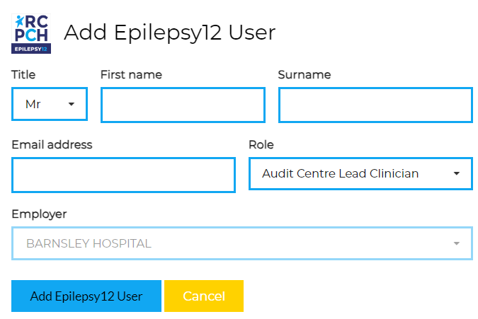

## Creating, Editing and Deleting Users

Only lead clinician users can create, edit and delete users. 

### Add a new user

To add a new user, naviagate to the **staff view** and make sure you have selected the correct organisation at the top of the screen. Then click on the **Add a new user to ORGANISATION** button. 

You will need to provide the user's title, full name, email address and user group. 

### Editing and deleting users

To edit or delete a user, click the edit icon. 

You will then be able to edit the user's details or delete the user by clicking the red delete button. 

