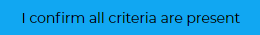

## Entering Patient Data

### Consent and opt out

Please note that Epilepsy12 has received an exemption the [NHS National Data Opt-out (England only)](https://www.rcpch.ac.uk/work-we-do/quality-improvement-patient-safety/epilepsy12-audit/methodology-data-submission#national-data-opt-out-exemption-england-only) and all eligible patients can therefore be registered onto the platform regardless of their NDO status.  Children and young people or their guardians may still choose not to participate in the Epilepsy12 audit specifically. If you add a patient to the audit and they choose to opt-out, you can delete their record. View the guidance below on this. 

### Add a new patient

To add a new patient, navigate to the **cohort view** and click the **Add a new Child/Young Person** button

You will need to provide the patient's first name, surname, date if birth, sex, postcode, NHS number and ethnicity. 

**This is not real patient data**

If you are unable to provide a postcode, click the **No postcode** button and you will be asked to indicate the reason. 

The NHS number is checked against the NHS number [checksum](https://www.datadictionary.nhs.uk/attributes/nhs_number.html) to confirm that it is a valid NHS number. We also use this to check if the patient has already been entered into the audit at a previous date, to avoid duplication. 

### Entering audit data

Only clinician and lead clinician users will be able to do this. 

Once a patient has been added to the audit, you can navigate to the patient’s record in the cohort View. Click on the **Audit** button to the right of their name to access the audit data. 

You will need to verify that the patient meets the eligibility criteria for the audit before you can enter any data. Please note that this step is **not reversible**, so please read through the criteria carefully before confirming eligibility. For more information on this, please refer to our methodology overview.

You can navigate through pages in the audit form using the navigation pane on the left. Please complete all the questions in each section to reflect the care provided to the patient during the **first 12 months of care** following a first paediatric assessment. Each tab will turn pink once completed.

A blue dot next to a question indicates that it is incomplete. A pink tick will appear once the question is complete. 

### Performance Summary

This is the final tab of the audit form. Here you can see if the patient has successfully met each of the key performance indicator metrics. A pink tick signals they have met the indicator already and a blue triangle means that they have not yet met the indicator. A grey stop sign means that this performance indicator is not applicable for this patient, and this may appear if the patient does not meet the criteria for inclusion within the metric. 

### Delete a patient

Only lead clinician and clinician users can delete patient records.If a patient was erroneously added to the audit, or has opted-out, you can delete their record. 

Enter the cohort view and find the patient’s record. Click the **edit** button, which will take you to the patient details page. Scroll down and click the **Delete** button. 

