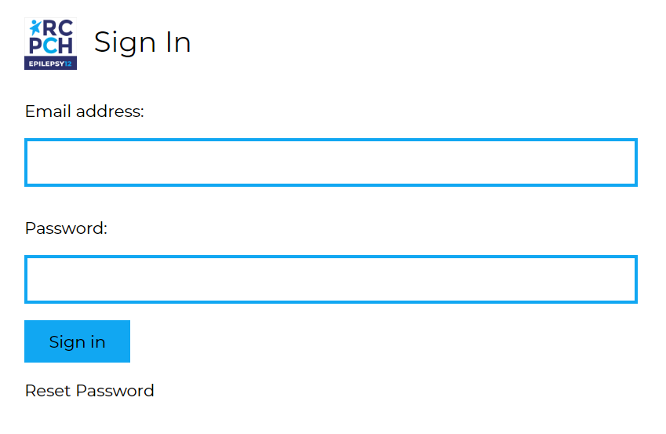

## Getting Started

### Making a new account

Lead Clinicians from Trusts/Health Boards will need to contact the Epilepsy12 team to create their account.

Clinicians and Administrators can ask their Lead to create an account for them. Alternatively, they can contact the Epilepsy12 team, who can create their account with written permission from the relevant Trust/Health Board Lead Clinician. 

If you are a lead, you can make new accounts by navigating to the `Staff View`, selecting the relevant organisation, and clicking the ‘Add new user’ button.

If your Trust/Health Board does not have a lead registered to the audit already, you will need select a Lead clinician and we will require approval from the Trust/Health Board’s Caldicott Guardian. This is to ensure that we are only providing trusted individuals with access to the Epilepsy12 platform and the data hosted within the system.

When your account is created, you’ll be emailed a link to set your password. This link expires after **72 hours**. If your link has expired, please contact the Epilepsy12 team to send you a new link.  

### Logging in

Click the ‘Sign in’ button on the home page to log in. 

 
If you have forgotten your password, click ‘Reset Password’ and a link to create a new password will be sent to your email address, and this will remain active for 72 hours.

 
