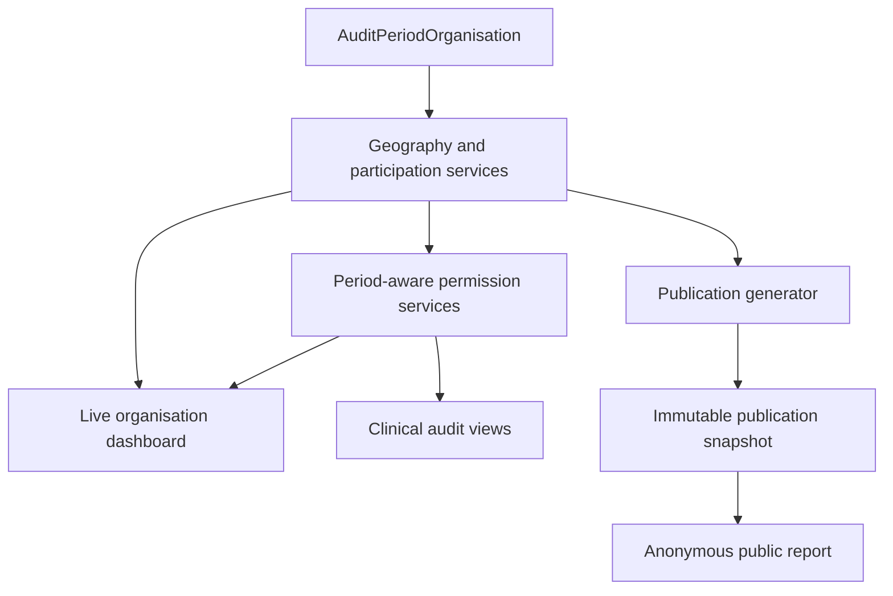

# Audit-period organisation membership and access

!!! note "Document status"
    Draft design proposal. This is a substantial reporting, routing and access-control foundation. It should be delivered before the proposed public KPI publication workflow, which is contingent on the period-aware organisation source of truth described here.

## Summary

An organisation's current Trust, Local Health Board and other geographical relationships do not reliably describe its relationships in a historical audit period. Organisations can move between parent bodies while several Epilepsy12 cohorts remain in recruitment, data collection, grace or submission.

The proposed solution is an explicit `AuditPeriodOrganisation` model with one approved row for each organisation and audit period. It would record:

- whether the organisation participates in reporting for the audit period; and
- the Trust/LHB and wider reporting geographies that apply to that organisation in that audit period.

A shared service layer would use this model for:

1. period-aware geography resolution;
2. period-aware permissions;
3. the live organisation dashboard;
4. protection of clinical audit and submission workflows; and
5. public publication generation.

The live dashboard would continue to query live clinical records. The publication workflow would use the same approved membership rows as an input, then copy them into an immutable publication snapshot. Anonymous public views would query only that snapshot.

This foundation includes a new model and migration, historical data backfill, service-layer work, permission changes, route changes, and substantial changes to `selected_organisation_summary` and its templates. It is not a small preliminary part of publication implementation. Publication generation should not begin until this foundation is complete and its historical memberships have been approved.

The report builder is a separate downstream refactor. Its existing route and facet implementation can continue unchanged while this foundation is added. This requires an explicit compatibility boundary: retain the current `Organisation` relationships and legacy report-builder permission path, and introduce the new period-aware dashboard services alongside them rather than replacing every shared helper globally. The report builder will continue to have its existing current-geography, all-period semantics until it is deliberately refactored.

## Problem

`Organisation` currently holds mutable relationships to its present-day:

- Trust;
- Local Health Board;
- Integrated Care Board;
- NHS England region;
- OPEN UK network; and
- country.

Those fields are useful as current operational/directory information, but cohort-filtered reporting currently traverses them when constructing Trust, ICB, region and network summaries. Consequently, if Organisation A moves from Trust A to Trust B, recalculating or displaying an earlier cohort can incorrectly place its earlier data under Trust B.

The same issue affects access control. The current organisation whitelist expands a user's active employment into access to organisations under the user's current Trust or LHB. It does not include the selected audit period as an authorisation dimension.

This is already relevant to the authenticated organisation dashboard and clinical-record permissions; it is not only a future public-reporting concern.

## Agreed temporal rule

The initial design assumes that an organisation has one approved reporting affiliation for a complete `AuditPeriod`.

An organisational change takes effect from an explicitly selected audit period, not from the date on which the `Organisation` row is updated. Effective dates within an audit period are therefore not required by the initial model.

For example, if Organisation A moves from Trust A to Trust B from cohort 9:

| Audit period | Concurrent status may be | Organisation A reporting Trust |
|---|---|---|
| Cohort 7 | Submission | Trust A |
| Cohort 8 | Data collection or grace | Trust A |
| Cohort 9 | Recruitment | Trust B |

Data entered after the reorganisation for a cohort 7 or cohort 8 registration would continue to be attributed to Trust A. Attribution follows `Registration.audit_period`, not the date of data entry and not the current value of `Organisation.trust`.

If policy later requires a relationship to change within one audit period, this design would need an effective-dated membership model and an agreed attribution event. That is outside the initial proposal.

## Proposed `AuditPeriodOrganisation` model

A provisional model shape is:

```python
class AuditPeriodOrganisation(models.Model):
    audit_period = models.ForeignKey(
        AuditPeriod,
        on_delete=models.PROTECT,
        related_name="organisation_memberships",
    )
    organisation = models.ForeignKey(
        Organisation,
        on_delete=models.PROTECT,
        related_name="audit_period_memberships",
    )

    included_in_reporting = models.BooleanField(default=True)

    country = models.ForeignKey(Country, on_delete=models.PROTECT)
    trust = models.ForeignKey(
        Trust,
        null=True,
        blank=True,
        on_delete=models.PROTECT,
    )
    local_health_board = models.ForeignKey(
        LocalHealthBoard,
        null=True,
        blank=True,
        on_delete=models.PROTECT,
    )
    integrated_care_board = models.ForeignKey(
        IntegratedCareBoard,
        null=True,
        blank=True,
        on_delete=models.PROTECT,
    )
    nhs_england_region = models.ForeignKey(
        NHSEnglandRegion,
        null=True,
        blank=True,
        on_delete=models.PROTECT,
    )
    openuk_network = models.ForeignKey(
        OPENUKNetwork,
        null=True,
        blank=True,
        on_delete=models.PROTECT,
    )

    approved_at = models.DateTimeField(null=True, blank=True)
    approved_by = models.ForeignKey(...)
    source = models.CharField(...)
    notes = models.TextField(blank=True)

    history = HistoricalRecords()

    class Meta:
        constraints = [
            models.UniqueConstraint(
                fields=["audit_period", "organisation"],
                name="unique_organisation_membership_per_audit_period",
            ),
        ]
```

The exact audit fields and approval workflow remain to be designed.

### Model responsibilities

The model should answer these questions for one period:

- Did this organisation participate in the audit?
- Should cases at this organisation contribute to reporting?
- Which Trust or Local Health Board contained the organisation?
- Which ICB, NHS England region, OPEN UK network and country applied?
- Who approved the assignment, when and from which source?

### Validation

Validation should include:

- one row at most per organisation and audit period;
- an appropriate Trust or LHB assignment for the organisation's country;
- no English-only geography on a Welsh organisation;
- required country and parent assignments for included organisations;
- stable reference codes on all reporting geographies;
- approval before the row can be used for publication; and
- protection against deleting referenced organisations and geographies.

Trusts, LHBs and other geography entities referenced historically should be retired or marked inactive rather than deleted.

### Relationship with current `Organisation` fields

During migration, the existing parent fields on `Organisation` can remain for compatibility. Their meaning should be explicit:

- `Organisation` relationships: current operational/directory relationships;
- `AuditPeriodOrganisation` relationships: approved reporting relationships for a specific audit period.

Cohort-aware reporting and permission checks must use `AuditPeriodOrganisation`. They must not silently fall back to the current `Organisation` relationships once the migration is complete.

## Shared service layer

Views, decorators and publication jobs should not each implement their own membership rules. A shared service layer should provide a small, tested API.

### Geography services

Suggested responsibilities include:

```text
get_membership(organisation, audit_period)
get_reporting_hierarchy(organisation, audit_period)
get_participating_organisations(audit_period)
get_organisations_for_parent(audit_period, parent)
get_expected_reporting_geographies(audit_period)
```

The services should accept an `AuditPeriod` instance rather than an integer cohort wherever possible.

Parent-level case queries should first resolve the organisation IDs assigned to that parent for the selected period, then filter cases by both those organisation IDs and `Registration.audit_period`.

They should not traverse mutable paths such as:

```python
epilepsy12_sites__organisation__integrated_care_board
```

for period-aware reporting.

### Permission services

Suggested responsibilities include:

```text
can_view_organisation_for_period(user, organisation, audit_period)
can_edit_case_for_period(user, case, audit_period)
get_accessible_periods(user, organisation)
get_accessible_memberships(user, audit_period)
get_accessible_organisations(user, audit_period, parent=None)
```

These functions should be the source for route guards, dashboard selectors, HTMX callbacks, downloads and direct clinical-record access.

## Permission model

Once historical affiliation affects access, an organisation ID alone is not a complete authorisation context. The selected audit period is also required.

### Direct and inherited access

The recommended starting policy distinguishes:

1. **Direct organisation access** — a user with active employment at Organisation A may access Organisation A's applicable historical or in-flight cohorts so that a reorganisation does not prevent completion of existing records.
2. **Inherited Trust/LHB access** — a user elsewhere in a Trust or LHB may access Organisation A only for audit periods in which `AuditPeriodOrganisation` assigns Organisation A to that parent.
3. **RCPCH access** — authorised RCPCH audit team and administrative users retain their broader access.

For Organisation A moving from Trust A to Trust B from cohort 9, a possible policy is:

| User | Cohort 8 | Cohort 9 |
|---|---:|---:|
| Direct Organisation A user | Yes | Yes |
| User elsewhere in Trust A | Yes | No |
| User elsewhere in Trust B | No | Yes |
| Authorised RCPCH user | Yes | Yes |

Whether direct Organisation A access includes all historical periods or only periods still open for data collection/submission is a governance decision. Editing remains separately constrained by the audit period and organisation-specific submission deadlines.

A direct Organisation A exception must not grant that user access to every historical organisation in Trust A. Direct access applies to Organisation A itself; inherited sibling access remains parent-and-period-aware.

### Access must be enforced server-side

Filtering dropdowns is not a security control by itself. The same permission service must reject:

- manually constructed historical dashboard URLs;
- direct case and registration URLs;
- field-level HTMX requests;
- downloads;
- KPI refresh actions; and
- parent/organisation selector callbacks.

The existing child-record permission path currently uses current Trust relationships and will need to resolve the child's `Registration.audit_period` and period membership instead.

### Unregistered cases

A case may not yet have `Registration.audit_period`, because the period is assigned from the first paediatric assessment date during registration. Access before that assignment cannot be period-based.

The registration-start workflow should therefore use a separately defined rule, most likely direct/current organisation access. Once `Registration.audit_period` exists, all subsequent reporting and inherited access should use the period-aware policy.

## Audit-period-aware routes

### Organisation dashboard

The dashboard route should contain the authoritative `AuditPeriod.slug` because an organisation has many period-specific summaries and the period affects authorisation.

Current shape:

```text
/organisation/<organisation_id>/summary
```

Proposed canonical shape:

```text
/organisation/<organisation_id>/audit-periods/<audit_period_slug>/summary/
```

The view should resolve the slug to an `AuditPeriod`, check period-aware permission, and retain that object throughout dashboard queries.

The legacy route can redirect to the latest audit period that the requesting user may access for the selected organisation. It must not select a period merely because that period is globally latest.

A legacy `?cohort=<number>` URL can similarly redirect to the canonical slug URL during migration.

### Case collections

Case-list routes that represent one period should also be audit-period-aware:

```text
/organisation/<organisation_id>/audit-periods/<audit_period_slug>/cases/
```

An explicitly named all-periods collection may remain where there is a valid use case, but it must include only periods and records the user is authorised to see. The report builder is treated separately below because its refactor is deferred until after this foundation.

### Parent and organisation selectors

The selector order should conceptually become:

```text
Audit period
    -> permitted Trust/LHB
        -> permitted organisation
```

Period-aware HTMX endpoints might follow this shape:

```text
/audit-periods/<audit_period_slug>/parents/<parent_type>/<parent_code>/organisations/
/audit-periods/<audit_period_slug>/organisations/select/
```

The exact endpoint names can be agreed during implementation. Every selector request must carry the period slug and apply the same server-side access service as the destination dashboard.

Stable parent codes are preferable to database primary keys where practical, although these authenticated internal routes do not have the same public stability requirement as publication URLs.

## Do audit-form routes also need the audit-period slug?

Not generally.

The dashboard and case-list routes need a period because they address a collection or summary that is otherwise ambiguous. A registered case and its related clinical models already have an authoritative period path:

```text
related model -> Registration -> audit_period
```

`Registration.audit_period` is authoritative. `Registration.cohort` is a legacy integer and should not be used as the primary period source.

Adding `audit_period_slug` to every assessment, investigation, management and field-level HTMX route would duplicate state already held by the registration. It would also introduce a mismatch risk such as a cohort 8 registration being submitted to a URL containing the cohort 9 slug.

The preferred pattern for case and related-model routes is:

1. resolve the case or related model from the route identifier;
2. walk to its `Registration`;
3. obtain `Registration.audit_period`;
4. resolve the lead organisation;
5. authorise using the matching `AuditPeriodOrganisation`; and
6. apply the period's editability/submission rules.

For example, an existing route such as:

```text
/assessment/<case_id>/
```

can remain identifier-based if its view derives and validates the period from the case's registration.

A period slug may be included in a higher-level audit route for navigation or readability, but if present it must be checked against `Registration.audit_period` and rejected on mismatch. It must never override the model relationship.

The registration-creation route is a further reason not to require a slug everywhere: before the first paediatric assessment date is known, the registration may not yet belong to an audit period.

## Critical submission workflow compatibility

Clinical audit submission is a critical workflow and must remain operational throughout this work. Submission compatibility is therefore part of the first foundation step, not deferred to the publication implementation.

### Submission deadlines and extensions

The existing `AuditPeriodExtension` model already has the correct temporal identity: one extension for an organisation and audit period. It does not derive its meaning from the organisation's Trust or LHB and does not need to be replaced by, or made a child of, `AuditPeriodOrganisation`.

The following behaviour should remain unchanged:

- the audit-wide deadline belongs to `AuditPeriod`;
- an organisation-specific extension belongs to `(AuditPeriod, Organisation)`;
- `Registration.days_remaining_before_submission` resolves through `Registration.audit_period` and the lead organisation; and
- `Case.editable()` uses that resolved deadline.

It may be useful to validate that a corresponding `AuditPeriodOrganisation` exists before creating an extension, and the extension administration interface should offer organisations participating in the selected period. This is validation and user-interface integration, not a change to deadline semantics.

The existing extension route uses an integer cohort. It should move to the authoritative slug shape while preserving the same model operation:

```text
/organisation/<organisation_id>/audit-periods/<audit_period_slug>/extension/
```

### Submission, locking and clinical forms

Case submission/locking does not need a new state model. Its permission guard does need to derive the case's `Registration.audit_period` and use the period-aware access service before allowing the operation.

Direct organisation users must retain the agreed ability to complete in-flight registrations from an older affiliation after their organisation moves. Parent-inherited access must follow the registration's period membership. The same rule applies to all assessment, investigation, management and field-level HTMX writes.

Redirects after registration, submission, locking or related actions should return to the correct audit-period-aware case list or dashboard. They must not drop the period and silently select a different cohort.

### Organisational Audit

`OrganisationalAuditSubmission` is a separate, Trust/LHB-level annual workflow with its own `OrganisationalAuditSubmissionPeriod`. It is not an Epilepsy12 `AuditPeriod` publication snapshot and should not be migrated to `AuditPeriodOrganisation` as part of this work.

It is nevertheless critical and must be included in first-step compatibility testing because its views and permission guards use current Trust/LHB relationships. The foundation must preserve its existing routes, submission state, editing rules, exports and authorised access while period-aware clinical permissions are introduced.

Unless a separate requirement is agreed, Organisational Audit should continue to use its own submission period and current Trust/LHB context. Shared permission helpers should not be changed globally in a way that accidentally applies clinical audit-period semantics to this distinct workflow.

## Live organisation dashboard

The authenticated dashboard remains a live reporting product; it does not read publication snapshots.

For a selected organisation and audit period it should:

- display the selected period prominently;
- display the organisation's reporting membership for that period;
- distinguish historical reporting membership from current contact/directory details;
- calculate organisation KPIs from live records in that period;
- calculate Trust/LHB, ICB, region and network comparators using period memberships;
- show only audit periods the user may access; and
- reject unauthorised period changes server-side.

A historical membership panel could say:

> Cohort 8 reporting affiliation: Trust A, ICB X, NHS Region Y. Organisation A moved to Trust B from Cohort 9.

### Demographics and maps

Demographic charts and maps on a period-aware dashboard should use the selected `AuditPeriod` consistently.

Several existing demographic summaries are described as covering all cohorts. Once access varies by audit period, an unqualified all-cohort result could include records the user is not authorised to see. The safest initial design is therefore:

- KPI summaries: selected period;
- demographic summaries: selected period;
- patient map and travel calculations: selected period; and
- parent/hierarchy comparators: selected period.

A later "all authorised periods" view could be provided if needed, but it must list the periods included and filter them through the permission service.

Current address, contact details and lead-centre coordinates may continue to come from `Organisation` if they are clearly presented as current information. Historical address or coordinate accuracy would require separate period-specific data and is not part of this proposal.

## Deferred report-builder refactor

The report builder is not required to implement the initial `AuditPeriodOrganisation` foundation and should be refactored as a separate step after the new model, services, permissions and audit-period-aware routes are in place.

### Compatibility during the foundation

Adding `AuditPeriodOrganisation` is additive and does not by itself affect the report builder. The existing report builder can continue to use:

- its current `/case-filter/<organisation_id>/` route;
- the existing `OrganisationAccessMixin` behaviour;
- current parent fields on `Organisation`;
- its existing organisation and clinical facet queries;
- its legacy `Registration.cohort` filter; and
- its existing current-geography, all-period interpretation.

To preserve that behaviour during the foundation:

1. retain the current parent fields on `Organisation`;
2. do not change or remove the legacy report-builder URL;
3. introduce period-aware dashboard and clinical permission services alongside the existing report-builder access path rather than changing a shared mixin incompatibly;
4. keep `Registration.cohort` populated for compatibility until the report builder is refactored; and
5. add a regression test that loads the report builder and exercises representative facets after the new model and migration are applied.

The report builder is linked to case and related-model routes. Those destination routes may apply the new period-aware clinical permission rules even while the facet page retains its existing semantics. This should be included in regression testing so that the report builder does not produce broken links or unexpected errors for its established users.

This compatibility approach deliberately preserves existing behaviour; it does not make the report builder historically geography-aware. Its Trust/LHB, ICB, region and country facets will continue to traverse current organisation relationships, and its cohort facet will continue to be an optional filter within an all-period report. That existing limitation is accepted until the separate refactor.

If implementation changes make that compatibility boundary impractical, temporarily disabling the report builder remains a fallback, but it is not required merely because `AuditPeriodOrganisation` has been added.

### Subsequent refactor

When the report builder is upgraded, its canonical route should become:

```text
/organisation/<organisation_id>/audit-periods/<audit_period_slug>/report-builder/
```

It should then:

1. resolve the slug to an `AuditPeriod`;
2. authorise the organisation and period before constructing the queryset;
3. filter through `Registration.audit_period`, not `Registration.cohort`;
4. derive geography facets and counts from `AuditPeriodOrganisation`;
5. calculate every facet from the already-authorised base queryset; and
6. reject manually constructed requests for unauthorised periods.

An all-period report builder could be considered later, but it would need to union only the organisation-period combinations the user may access and clearly state the periods included.

## Public publication workflow

This work is separate from the publication lifecycle, but the publication generator is entirely dependent on it. `AuditPeriodOrganisation`, its approved historical data and its geography services are prerequisites for correct public aggregation. Public publication generation should be treated as blocked until this foundation is complete.

The relationship is:



For publication generation:

1. an authorised audit-team user selects an `AuditPeriod`;
2. the generator obtains approved, included `AuditPeriodOrganisation` rows;
3. it calculates all public geography aggregations using those memberships;
4. it copies the relevant organisation memberships, geography codes, names and relationships into publication-owned snapshot rows;
5. it validates the complete draft; and
6. it atomically activates the new publication.

Public views must not query `AuditPeriodOrganisation`, `Organisation` or live clinical records. They use only the active publication snapshot.

If a historical `AuditPeriodOrganisation` assignment is corrected after publication, the existing publication remains unchanged. The correction requires generation and activation of a complete replacement publication.

## Migration and backfill

Historical membership cannot necessarily be inferred reliably from the present-day `Organisation` foreign keys.

A backfill process should:

1. create one candidate row per participating organisation and audit period;
2. use existing history and authoritative organisational data as evidence where available;
3. record the source/provenance of each assignment;
4. identify incomplete or ambiguous assignments;
5. require audit-team review and approval; and
6. prevent public publication while required memberships remain incomplete.

`django-simple-history` records may help reconstruct changes but should not become the reporting policy or sole source of truth. They record database changes, not necessarily the audit period from which a reorganisation was intended to apply.

## Implementation plan — focused atomic pull requests

The foundation should be delivered as a sequence of focused, deployable pull requests rather than one large feature branch. Each pull request should have one clear responsibility, include its own tests, and preserve the existing live application unless it explicitly performs a tested route cutover.

General rules for the sequence are:

- retain the current parent fields on `Organisation` throughout the foundation;
- retain `Registration.cohort` for compatibility, while new code uses `Registration.audit_period`;
- do not make publication code depend on incomplete or unreviewed membership data;
- do not refactor the report builder during the foundation;
- preserve clinical submission and Organisational Audit behaviour in every deployable state;
- introduce new services alongside legacy call sites before switching consumers; and
- run the full test suite before merging each pull request, in addition to the targeted tests listed below.

### Optional PR 0 — critical-workflow characterisation tests

This is a test-only pull request if the current coverage is not sufficient to protect the following work.

Scope:

- add end-to-end characterisation tests for registration, editing, extension, submission and locking;
- add explicit regression coverage for Organisational Audit access, editing, submission and export;
- add a smoke test for the current report-builder route and representative facets; and
- record the current dashboard route and redirect behaviour.

Likely test areas:

- `epilepsy12/tests/model_tests/test_audit_period.py`;
- `epilepsy12/tests/view_tests/test_audit_period_extension.py`;
- `epilepsy12/tests/view_tests/permissions_tests/test_permissions_closed_cohort.py`;
- `epilepsy12/tests/view_tests/permissions_tests/test_permissions_organisational_audit.py`;
- `epilepsy12/tests/view_tests/test_organisation_views.py`; and
- `epilepsy12/tests/view_tests/case_filters/`.

Exit condition: the critical existing workflows have tests that will fail if later shared-service or permission changes cause a regression.

### PR 1 — `AuditPeriodOrganisation` model and schema migration

This pull request is additive and must not change any runtime query, route or permission behaviour.

Scope:

- add the `AuditPeriodOrganisation` model;
- add the foreign keys, constraints, indexes, audit fields and `HistoricalRecords` agreed for the model;
- expose the model through `epilepsy12.models`;
- register a minimal Django admin representation;
- add a schema migration;
- add an explicit test factory or fixture for period memberships; and
- retain every existing parent field on `Organisation`.

Do not include publication models, dashboard query changes, permission changes or report-builder changes.

New tests should cover:

- one row per `(audit_period, organisation)`;
- valid English Trust/ICB/region membership;
- valid Welsh LHB membership;
- invalid or incomplete parent combinations;
- `PROTECT` behaviour for referenced audit periods, organisations and geographies;
- history creation; and
- coexistence of different parent assignments for the same organisation in concurrent periods.

Expected existing-test refactoring should be minimal. Test factories that create an organisation and audit period should not silently create a membership unless the test explicitly asks for one; otherwise missing-membership cases become difficult to test.

Exit condition: the migration can be deployed to the live database without changing current application behaviour.

### PR 2 — population, approval and geography service layer

This pull request populates and reads the new source of truth but still does not switch user-facing routes.

Scope:

- add an idempotent management command or controlled staff workflow to create candidate membership rows for existing audit periods;
- copy current `Organisation` relationships only as candidate data, with provenance recorded;
- provide a review/approval workflow for historical assignments;
- report missing or ambiguous relationships rather than guessing them;
- add the geography service functions such as `get_membership()`, `get_reporting_hierarchy()` and `get_organisations_for_parent()`; and
- add readiness validation that can report whether an audit period has complete approved memberships.

A normal data migration should not silently declare reconstructed historical relationships authoritative. Historical backfill needs an auditable, repeatable process and clinical/audit-team review.

New tests should cover:

- command/workflow idempotency;
- candidate provenance;
- preservation of an already-reviewed historical assignment;
- missing-geography reporting;
- approval and readiness checks;
- service results for Organisation A moving from Trust A to Trust B between periods; and
- queries accepting an `AuditPeriod` instance rather than a cohort integer.

Existing fixtures and seeded data may need explicit membership rows where these new services are exercised. Existing application consumers remain on their old paths in this pull request.

Exit condition: required historical membership rows can be generated, reviewed and queried without changing the live dashboard.

### PR 3 — period-aware permission services

This pull request adds the new permission vocabulary without yet replacing unrelated permission paths globally.

Scope:

- implement `can_view_organisation_for_period()`;
- implement accessible-period, accessible-parent and accessible-organisation queries;
- distinguish direct organisation access from inherited Trust/LHB access;
- implement case/registration period resolution through `Registration.audit_period`;
- define the pre-registration rule for cases without an audit period; and
- leave the existing report-builder mixin and Organisational Audit permission path unchanged.

New tests should use a reorganisation fixture and cover:

- direct Organisation A access to the agreed older in-flight periods;
- Trust A inherited access before the move;
- Trust B inherited access from the effective period;
- denial for the opposite period in each Trust;
- RCPCH access;
- inactive employment;
- unregistered cases; and
- absence or ambiguity of required membership rows.

Likely existing-test refactoring includes permission factories and tests that currently infer access solely from `Organisation.trust` or `Organisation.local_health_board`.

Exit condition: the new permission service is fully tested but only consumers explicitly migrated to it change behaviour.

### PR 4 — audit-period-aware dashboard routes, views and templates

This is the first user-facing cutover and should be limited to the organisation dashboard vertical slice.

Scope:

- add the canonical dashboard route:

  ```text
  /organisation/<organisation_id>/audit-periods/<audit_period_slug>/summary/
  ```

- make the legacy dashboard route redirect to the latest period that the user may access;
- replace the `?cohort=<number>` dashboard state with `AuditPeriod.slug` routing;
- update `selected_organisation_summary` to retain the resolved `AuditPeriod` and `AuditPeriodOrganisation` throughout the request;
- update parent and organisation selector endpoints to carry the period slug;
- update selector permission checks to use the new service;
- update the membership panel and parent labels to show the selected period's relationships;
- scope KPI summaries, demographics, maps and travel calculations to the selected period;
- resolve Trust/LHB, ICB, region and network comparison queries through period memberships; and
- update links from the dashboard to retain the selected period where the destination is period-aware.

This pull request will require substantial test refactoring because the canonical route signature changes. Likely affected tests include:

- `epilepsy12/tests/view_tests/test_organisation_views.py`;
- `epilepsy12/tests/view_tests/authentication_and_authorization/test_login.py`;
- aggregation and report-query tests under `common_view_functions_tests`;
- tests that reverse `selected_organisation_summary`;
- template assertions that use current `Organisation` parents; and
- tests that pass `?cohort=` directly.

New tests should cover:

- canonical slug URLs;
- legacy redirects;
- inaccessible and invalid periods;
- period-specific parent and organisation dropdowns;
- historical membership labels;
- period-specific KPI and demographic querysets;
- period-specific map payloads;
- Organisation A appearing under Trust A in cohort 8 and Trust B in cohort 9; and
- no mixing of records from another period.

Exit condition: the organisation dashboard is fully period-aware and no longer relies on current parent relationships for historical summaries.

### PR 5 — period-aware case collections and clinical permissions

This pull request applies the established period context to patient-facing collections and direct clinical access while keeping field-level URLs identifier-based.

Scope:

- add the canonical period case-list route:

  ```text
  /organisation/<organisation_id>/audit-periods/<audit_period_slug>/cases/
  ```

- define the compatibility behaviour of the existing all-children/all-cohort list;
- update case-list queries and links to retain the selected period;
- migrate child-record permission guards to derive `Registration.audit_period`;
- apply the direct-versus-inherited access policy to registration and all related models;
- retain identifier-based assessment, investigation, management and HTMX field routes;
- validate any optional route period against `Registration.audit_period`; and
- ensure unauthorised direct URLs fail server-side.

Likely affected tests include:

- `epilepsy12/tests/view_tests/permissions_tests/`;
- `epilepsy12/tests/view_tests/case_filters/test_case_list_filters.py` for the ordinary case list, not the report builder;
- tests that reverse the `cases` route;
- clinical form view tests using `user_may_view_this_child()`; and
- transfer, consent and performance-summary tests that redirect to an organisation case list.

New tests should cover:

- period-specific case collections;
- direct organisation access to older in-flight registrations;
- inherited parent access and denial across the reorganisation boundary;
- unregistered-case access;
- route/model period mismatch;
- field-level GET and POST protection; and
- redirects retaining the period slug.

Exit condition: dashboard, case collections and direct clinical views enforce the same period-aware access policy.

### PR 6 — submission, extension and Organisational Audit compatibility

This pull request completes and proves the critical-workflow integration. It should avoid changing the underlying submission models unless a test exposes a genuine defect.

Scope:

- change the extension route from integer cohort to `AuditPeriod.slug`;
- optionally validate that the organisation has a membership row for the selected period;
- preserve `AuditPeriodExtension` identity and deadline calculations;
- preserve `Registration.days_remaining_before_submission` and `Case.editable()` semantics;
- update submission/locking redirects to preserve period context;
- verify that direct organisation users can complete agreed older in-flight registrations;
- keep `OrganisationalAuditSubmission` and `OrganisationalAuditSubmissionPeriod` unchanged; and
- keep Organisational Audit permissions on their existing, separately tested semantics.

Likely affected tests include:

- `epilepsy12/tests/model_tests/test_audit_period.py`;
- `epilepsy12/tests/model_tests/test_registration.py`;
- `epilepsy12/tests/view_tests/test_audit_period_extension.py`;
- `epilepsy12/tests/view_tests/permissions_tests/test_permissions_closed_cohort.py`;
- submission and locking tests in `case_views`; and
- `epilepsy12/tests/view_tests/permissions_tests/test_permissions_organisational_audit.py`.

New or updated tests should prove:

- extension GET and POST use the period slug;
- extend, close and remove still update the same row;
- deadline and editability calculations are unchanged;
- closed-period editing is still denied;
- direct users can finish permitted in-flight records after a move;
- submission and locking use period-aware permission checks;
- Organisational Audit access, editing, submission and export are unchanged; and
- shared helper changes do not alter Organisational Audit behaviour.

Exit condition: all critical submission workflows pass their focused regression suites under the new permission and routing foundation.

### PR 7 — foundation hardening and publication readiness

Scope:

- remove temporary dashboard fallbacks to current parent geography;
- add diagnostics for missing memberships;
- verify indexes and query counts with production-scale data;
- document the staff process for applying a reorganisation from a chosen audit period;
- complete approved historical backfill;
- run end-to-end access tests across concurrent periods;
- run unchanged report-builder smoke/facet tests; and
- expose a publication-readiness result for each audit period.

Exit condition: the foundation is complete, historical memberships are approved, critical workflows are stable, and public publication implementation can safely begin.

## Second-stage report-builder pull requests

The report builder remains live with its existing current-geography, all-period semantics throughout the foundation. Its refactor begins only after PR 7.

### Report-builder PR 1 — period-aware route, base queryset and permissions

Scope:

- add the canonical route:

  ```text
  /organisation/<organisation_id>/audit-periods/<audit_period_slug>/report-builder/
  ```

- resolve and authorise the `AuditPeriod` before constructing the queryset;
- filter the base queryset through `Registration.audit_period`;
- update the cohort facet or remove it when redundant;
- preserve search and non-geographical clinical facets; and
- redirect the legacy route according to an agreed compatibility policy.

Tests should update `epilepsy12/tests/view_tests/case_filters/`, authentication tests and URL reversals, and prove that facet counts are calculated only from the authorised period queryset.

### Report-builder PR 2 — period-aware geography facets

Scope:

- refactor Trust/LHB, ICB, NHS England region and country filters to use `AuditPeriodOrganisation`;
- derive geography choices and counts from period memberships;
- remove use of `Registration.cohort` from report-builder queries; and
- add reorganisation tests proving that cohort 8 and cohort 9 produce their respective geography facets.

Tests should update `epilepsy12/tests/filterset_tests/test_filtersets.py` and the report-builder view tests. Existing clinical facet tests should remain unchanged wherever their behaviour is independent of geography.

## Publication work after the foundation

Publication schema exploration may proceed independently, but publication generation and public aggregation are blocked until PR 7 is complete. Once the foundation is ready, publication implementation can use the approved membership and geography services and copy them into immutable publication snapshots.

## Testing requirements

### Model and service tests

- only one membership exists per organisation and audit period;
- concurrent audit periods can hold different parent assignments;
- Trust/LHB and country validation is enforced;
- parent organisation sets are resolved from period memberships;
- no reporting query silently falls back to current geography;
- incomplete/unapproved memberships block publication readiness.

### Permission tests

Using an organisation that moves from Trust A to Trust B from cohort 9:

- direct Organisation A users receive the agreed historical/in-flight access;
- inherited Trust A users can access cohort 8 but not cohort 9;
- inherited Trust B users can access cohort 9 but not cohort 8;
- RCPCH users retain their approved access;
- unauthorised direct URLs and HTMX requests are rejected;
- case and field routes derive the period from `Registration.audit_period`;
- a route period, when supplied, cannot disagree with the registration period;
- pre-registration access follows the separately approved rule.

### Dashboard tests

- canonical dashboard URLs contain `AuditPeriod.slug`;
- legacy routes redirect to an accessible canonical period;
- period, parent and organisation selectors contain only permitted choices;
- membership labels reflect the selected period;
- parent KPI summaries use the selected period's hierarchy;
- demographics and maps contain only selected-period cases;
- pages do not mix data from unauthorised periods.

### Critical workflow regression tests

- registration can begin before an audit period has been assigned;
- assigning the first paediatric assessment date sets `Registration.audit_period` as before;
- direct organisation users can complete the agreed older in-flight registrations after a reorganisation;
- inherited users cannot view or edit a registration outside the target organisation's period membership;
- audit-wide and organisation-specific submission deadlines are unchanged;
- extensions remain keyed to `(AuditPeriod, Organisation)` and use the slug-aware route;
- `Case.editable()`, submission and locking retain their existing deadline and state behaviour;
- redirects preserve the selected audit period;
- Organisational Audit routes, permissions, editing, submission and exports continue to work under their existing submission-period semantics.

### Deferred report-builder tests

While the legacy feature is unchanged:

- its existing route still loads after the `AuditPeriodOrganisation` migration;
- existing organisation, cohort and clinical facets continue to operate;
- current-geography facet choices and counts retain their existing semantics;
- changes to shared permission helpers do not produce an uncontrolled report-builder failure; and
- links from report-builder results receive the expected decision from the new clinical permission service rather than raising an application error.

When it is refactored:

- the canonical route contains `AuditPeriod.slug`;
- the base queryset is authorised before facet counts are calculated;
- cohort filtering uses `Registration.audit_period`;
- geography filters and choices use `AuditPeriodOrganisation`; and
- no facet includes records from an unauthorised period.

### Publication integration tests

- publication generation uses approved `AuditPeriodOrganisation` rows;
- geography changes after generation do not alter a publication snapshot;
- correcting a historical membership requires a replacement publication;
- public views do not query live membership or clinical tables.

## Decisions still required

1. Do direct organisation users retain access to all historical periods or only open/in-flight periods?
2. Does period-aware parent access permit viewing only, or also editing while the registration remains editable?
3. Should a direct organisation user see historical parent aggregates even when they cannot open sibling organisations' patient records?
4. What is the authoritative source and approval workflow for historical membership backfill?
5. Should inactive organisations remain selectable for periods in which they participated?
6. Is an explicit "all authorised periods" dashboard view required?
7. Which current organisation fields remain operational sources after the migration, and which should eventually be derived from the latest membership?
8. Does the Organisational Audit permission model require any separately approved change following a Trust/LHB reorganisation, or should it continue to use current parent relationships?

These decisions affect access and presentation but do not change the central design: historical reporting affiliation is determined by `AuditPeriodOrganisation`, selected through `Registration.audit_period`, while publications retain their own immutable copy.