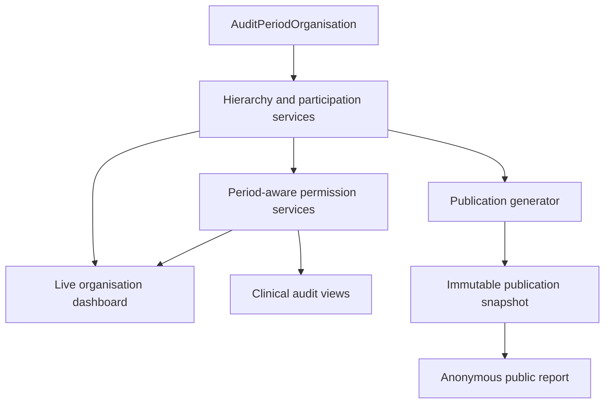

# Audit-period organisation membership and access

!!! note "Document status"
    Draft design proposal. This is a substantial reporting, routing and access-control foundation. It should be delivered before the proposed public KPI publication workflow, which is contingent on the period-aware organisation source of truth described here.

## Summary

An organisation's current Trust, Local Health Board and other organisational hierarchy relationships do not reliably describe its relationships in a historical audit period. Organisations can move between parent bodies while several Epilepsy12 cohorts remain in recruitment, data collection, grace or submission.

!!! note "Terminology: hierarchy vs mapping"
    Throughout this document, **organisational hierarchy** refers to the parent-child relationships between a base organisation (which owns cases and registrations) and its Trust, Local Health Board, Integrated Care Board, NHS England region, OPEN UK network and country. These are the relationships that change over time through mergers, acquisitions and reorganisations, and which must be versioned per audit period.

    This is distinct from **patient mapping** — the use of patient postcodes to calculate indices of multiple deprivation and plot patients on maps overlaid with health and government boundaries. Patient mapping was previously handled within E12 but has been deprecated and handed off to a JavaScript library that pulls from a hosted tile server. Legacy mapping fields may remain in the database, but the mapping code has been removed. References to "geography" in earlier design notes should be read as referring to organisational hierarchy, not patient mapping.

The proposed solution is an explicit `AuditPeriodOrganisation` model with one approved row for each organisation and audit period. It would record:

- whether the organisation participates in reporting for the audit period; and
- the Trust/LHB and wider organisational hierarchy that applies to that organisation in that audit period.

A shared service layer would use this model for:

1. period-aware hierarchy resolution;
2. period-aware permissions;
3. the live organisation dashboard;
4. protection of clinical audit and submission workflows; and
5. public publication generation.

The live dashboard would continue to query live clinical records. The publication workflow would use the same approved membership rows as an input, then copy them into an immutable publication snapshot. Anonymous public views would query only that snapshot.

This foundation includes a new model and migration, historical data backfill, service-layer work, permission changes, route changes, and substantial changes to `selected_organisation_summary` and its templates. It is not a small preliminary part of publication implementation. Publication generation should not begin until this foundation is complete and its historical memberships have been approved.

The report builder is a separate downstream refactor. Its existing route and facet implementation can continue unchanged while this foundation is added. This requires an explicit compatibility boundary: retain the current `Organisation` relationships and legacy report-builder permission path, and introduce the new period-aware dashboard services alongside them rather than replacing every shared helper globally. The report builder will continue to have its existing current-hierarchy, all-period semantics until it is deliberately refactored.

## Problem

`Organisation` currently holds mutable relationships to its present-day:

- Trust;
- Local Health Board;
- Integrated Care Board;
- NHS England region;
- OPEN UK network; and
- country.

Those fields are useful as current operational/directory information, but cohort-filtered reporting currently traverses them when constructing Trust, ICB, region and network summaries. Consequently, if Organisation A moves from Trust A to Trust B, recalculating or displaying an earlier cohort can incorrectly place its earlier data under Trust B.

The same issue affects access control. The current organisation whitelist expands a user's active employment into access to organisations under the user's current Trust or LHB. It does not include the selected audit period as an authorisation dimension.

This is already relevant to the authenticated organisation dashboard and clinical-record permissions; it is not only a future public-reporting concern.

## Agreed temporal rule

The initial design assumes that an organisation has one approved reporting affiliation for a complete `AuditPeriod`.

An organisational change takes effect from an explicitly selected audit period, not from the date on which the `Organisation` row is updated. Effective dates within an audit period are therefore not required by the initial model.

For example, if Organisation A moves from Trust A to Trust B from cohort 9:

| Audit period | Concurrent status may be | Organisation A reporting Trust |
|---|---|---|
| Cohort 7 | Submission | Trust A |
| Cohort 8 | Data collection or grace | Trust A |
| Cohort 9 | Recruitment | Trust B |

Data entered after the reorganisation for a cohort 7 or cohort 8 registration would continue to be attributed to Trust A. Attribution follows `Registration.audit_period`, not the date of data entry and not the current value of `Organisation.trust`.

If policy later requires a relationship to change within one audit period, this design would need an effective-dated membership model and an agreed attribution event. That is outside the initial proposal.

### Within-period ODS code changes

ODS code succession (a hospital changing its ODS code following a trust dissolution and redistribution) is handled by `OrganisationIdentity` (see below). The initial design assumes that an ODS code change takes effect between audit periods, not within one. If a hospital were to change ODS code part-way through an audit period's data-collection window, the `AuditPeriodOrganisation.organisation` FK would have to point at a single `Organisation` row while `Site.organisation` for cases registered before the change points at the predecessor and cases after point at the successor.

The per-cohort sync should validate this assumption against the API's succession data and report any within-period ODS code changes to the audit team for an explicit attribution decision. The default attribution rule, if a within-period change is encountered, is the ODS code in use at the case's `first_paediatric_assessment_date` — consistent with how `Registration.audit_period` itself is derived (`AuditPeriodManager.for_first_paediatric_assessment_date`).

## Proposed `AuditPeriodOrganisation` model

A provisional model shape is:

```python
class AuditPeriodOrganisation(models.Model):
    audit_period = models.ForeignKey(
        AuditPeriod,
        on_delete=models.PROTECT,
        related_name="organisation_memberships",
    )
    organisation = models.ForeignKey(
        Organisation,
        on_delete=models.PROTECT,
        related_name="audit_period_memberships",
    )

    included_in_reporting = models.BooleanField(default=True)

    country = models.ForeignKey(Country, on_delete=models.PROTECT)
    trust = models.ForeignKey(
        Trust,
        null=True,
        blank=True,
        on_delete=models.PROTECT,
    )
    local_health_board = models.ForeignKey(
        LocalHealthBoard,
        null=True,
        blank=True,
        on_delete=models.PROTECT,
    )
    integrated_care_board = models.ForeignKey(
        IntegratedCareBoard,
        null=True,
        blank=True,
        on_delete=models.PROTECT,
    )
    nhs_england_region = models.ForeignKey(
        NHSEnglandRegion,
        null=True,
        blank=True,
        on_delete=models.PROTECT,
    )
    openuk_network = models.ForeignKey(
        OPENUKNetwork,
        null=True,
        blank=True,
        on_delete=models.PROTECT,
    )

    approved_at = models.DateTimeField(null=True, blank=True)
    approved_by = models.ForeignKey(...)
    source = models.CharField(...)
    notes = models.TextField(blank=True)

    history = HistoricalRecords()

    class Meta:
        constraints = [
            models.UniqueConstraint(
                fields=["audit_period", "organisation"],
                name="unique_organisation_membership_per_audit_period",
            ),
        ]
```

The exact audit fields and approval workflow remain to be designed.

### Model responsibilities

The model should answer these questions for one period:

- Did this organisation participate in the audit?
- Should cases at this organisation contribute to reporting?
- Which Trust or Local Health Board contained the organisation?
- Which ICB, NHS England region, OPEN UK network and country applied?
- Who approved the assignment, when and from which source?

The hierarchy FKs (`trust`, `local_health_board`, `integrated_care_board`, `nhs_england_region`, `openuk_network`, `country`) are populated by the per-cohort sync from the API snapshot endpoint at the audit period's reference date. They are not edited manually except during the approval/review workflow, where the audit team may correct a sync-sourced assignment if the API data is incomplete or ambiguous.

### Validation

Validation should include:

- one row at most per organisation and audit period;
- an appropriate Trust or LHB assignment for the organisation's country;
- no English-only hierarchy on a Welsh organisation;
- required country and parent assignments for included organisations;
- stable reference codes on all reporting geographies;
- approval before the row can be used for publication; and
- protection against deleting referenced organisations and geographies.

Trusts, LHBs and other hierarchy entities referenced historically should be retired or marked inactive rather than deleted. To enforce this, the existing parent FKs on `Organisation` (`trust`, `local_health_board`, `integrated_care_board`, `nhs_england_region`, `openuk_network`) should be changed from `on_delete=models.CASCADE` to `on_delete=models.PROTECT` as part of the foundation migration. The `Organisation.country` FK is already `PROTECT`. This prevents a hierarchy entity deletion from cascading to delete `Organisation` rows and orphaning `Site`, `KPI` and `Registration` data. Existing relationships must not be broken by the migration; only the deletion behaviour changes.

### Relationship with current `Organisation` fields

During migration, the existing parent fields on `Organisation` can remain for compatibility. Their meaning should be explicit:

- `Organisation` relationships: current operational/directory relationships;
- `AuditPeriodOrganisation` relationships: approved reporting relationships for a specific audit period.

Cohort-aware reporting and permission checks must use `AuditPeriodOrganisation`. They must not silently fall back to the current `Organisation` relationships once the migration is complete.

### Organisation identity and ODS code succession

A hospital's ODS code can change when its parent trust is dissolved and its services are redistributed. For example, Princess Royal University Hospital changed its ODS code from `RYQ30` (under South London Healthcare NHS Trust, `RYQ`) to `RJZ30` (under King's College Hospital NHS Foundation Trust, `RJZ`) when South London Healthcare was dissolved in 2013.

This is a rare but significant event. It can happen more than once: a hospital could theoretically pass through two or more mergers, changing its ODS code each time (e.g. `RYQ30` → `RJZ30` → `RXZ40`). The design must handle arbitrary-length succession chains, not just single predecessor/successor pairs.

#### `OrganisationIdentity` model

To handle this cleanly, introduce a lightweight `OrganisationIdentity` model — one row per physical hospital, stable across ODS code changes:

```python
class OrganisationIdentity(models.Model):
    """
    The stable identity of a physical hospital, independent of ODS code.
    One row per hospital, ever. Does not change when trusts merge or ODS
    codes change. Used to link successive Organisation rows that represent
    the same hospital across code changes.
    """
    name = models.CharField(max_length=255)  # current name (for display)

    class Meta:
        verbose_name = "Organisation identity"
        verbose_name_plural = "Organisation identities"
```

The existing `Organisation` model gains a nullable FK to `OrganisationIdentity`:

```python
class Organisation(models.Model):
    # ... existing fields unchanged ...
    identity = models.ForeignKey(
        to="epilepsy12.OrganisationIdentity",
        on_delete=models.PROTECT,
        null=True,  # nullable during migration; backfilled
        blank=True,
        related_name="ods_codes",
    )
```

Multiple `Organisation` rows (one per ODS code) can point at the same `OrganisationIdentity`. For PRUH:

```
OrganisationIdentity(id=1, name="Princess Royal University Hospital")

Organisation(ods_code=RYQ30, identity=1, ...)  # dissolved, cases remain here
Organisation(ods_code=RJZ30, identity=1, ...)  # current
```

#### Why `OrganisationIdentity` rather than a self-FK on `Organisation`

A self-FK (`Organisation.successor_of`) would create a linked list. For a two-step chain (`RYQ30` → `RJZ30` → `RXZ40`), finding all ODS codes for the same hospital requires recursive traversal. `OrganisationIdentity` gives the full set in a single query:

```python
Organisation.objects.filter(identity=hospital_identity)
```

This matters for:

- **Longitudinal reporting** — following a hospital's results across ODS code changes between periods.
- **User access** — a clinician employed at the current ODS code (RJZ30) needs access to cases stored against the predecessor ODS code (RYQ30). Resolving this via `identity` is a single join.
- **Case visibility** — `Site.organisation` may point at a predecessor `Organisation` row. The clinician's access is resolved by checking whether their employer's `Organisation` shares the same `OrganisationIdentity`.

#### What does NOT change

- `Site.organisation` — stays pointing at the `Organisation` row the case was created against. Cases do not migrate. `Site` does **not** need to reference `AuditPeriodOrganisation` directly. The period-aware path is `Site.organisation` → `Registration.audit_period` → `AuditPeriodOrganisation`, resolved at query time by the permission and hierarchy services. `Site` continues to point at a single `Organisation` row; period-awareness is added at the service layer, not by changing the `Site` schema.
- `OrganisationEmployer.employer_organisation` — stays pointing at the current `Organisation` row. User memberships do not migrate.
- `Organisation.ods_code` — remains `unique=True`. Each ODS code is still one row.

The `OrganisationIdentity` is a grouping layer above `Organisation`, not a replacement for it. It is populated during the sync when the API's succession data indicates that two ODS codes represent the same physical hospital.

#### How `AuditPeriodOrganisation` uses identity

`AuditPeriodOrganisation.organisation` points at the `Organisation` row whose ODS code was in use during that audit period. For PRUH in cohort 5, this is the `RYQ30` row; for cohort 6 onwards, the `RJZ30` row. Both point at the same `OrganisationIdentity`.

When a clinician (employed at `RJZ30`) views cohort 5 data, the system resolves their access via the `OrganisationIdentity` chain: `RJZ30.identity == RYQ30.identity`, so the clinician has direct access to `RYQ30`'s cases for cohort 5.

For longitudinal reporting across code changes, the report groups by `OrganisationIdentity` rather than `Organisation.ods_code`, walking the chain via the API's `snapshot` endpoint (which already handles succession) or via the local `OrganisationIdentity` link.

### Preventing accidental use of current relationships

While both relationship paths exist, the database cannot prevent application code from traversing `Organisation.trust`, `Organisation.integrated_care_board` or the equivalent ORM paths. This requires an enforced application boundary rather than relying only on documentation.

Direct current-relationship access should be classified explicitly:

| Consumer | Current `Organisation` relationships allowed? |
|---|---|
| Organisation directory/admin and current contact details | Yes |
| Candidate historical-membership backfill | Yes, as unapproved source data |
| Legacy report builder until its second-stage refactor | Yes |
| Organisational Audit, unless its separate policy changes | Yes |
| Period-aware organisation dashboard | No |
| Registered-case inherited permissions | No |
| Period-aware KPI and demographic aggregation | No |
| Publication generation | No |

The boundary should be enforced in several complementary ways:

1. **Mandatory service APIs** — period-aware code must call hierarchy services that require both an `Organisation` and an `AuditPeriod`. A function that accepts only an organisation is not sufficient for period-aware hierarchy resolution.
2. **No fallback** — `get_membership()` should raise a specific missing/ambiguous-membership error. It must not fall back to `Organisation.trust` or another current relationship.
3. **Separated modules** — period-aware queries should live in clearly named hierarchy/reporting services. Current-directory lookup code should remain separate so that imports and reviews make the chosen semantics visible.
4. **Current-use inventory and allowlist** — before dashboard cutover, inventory direct uses of current parent fields and ORM paths. Each remaining use must be classified as intentionally current or scheduled for refactor.
5. **CI guard** — add a targeted static check, preferably an AST-aware project check, that rejects direct current-parent traversal in period-aware dashboard, permission, aggregation and publication modules. A reviewed allowlist should contain the temporary legacy consumers. A simple repository-wide grep is useful for inventory but is too imprecise to be the sole guard.
6. **Reorganisation canary tests** — use a standard fixture where Organisation A currently belongs to Trust B, belongs to Trust A in cohort 8, and belongs to Trust B in cohort 9. Every period-aware query and permission test should use this deliberately divergent data. Any accidental current relationship query will then fail visibly.
7. **Code-review rule** — new reporting or inherited-permission code that traverses a parent relationship must show where its `AuditPeriod` came from.

The strongest eventual safeguard would be to rename current fields to names such as `current_trust` and `current_integrated_care_board`, potentially retaining the existing database columns with `db_column`. That would make accidental use more obvious, but it would be a broad compatibility refactor and is not required for the initial foundation.

## Shared service layer

Views, decorators and publication jobs should not each implement their own membership rules. A shared service layer should provide a small, tested API.

### Hierarchy services

Suggested responsibilities include:

```text
get_membership(organisation, audit_period)
get_reporting_hierarchy(organisation, audit_period)
get_participating_organisations(audit_period)
get_organisations_for_parent(audit_period, parent)
get_expected_reporting_hierarchies(audit_period)
```

The services should accept an `AuditPeriod` instance rather than an integer cohort wherever possible.

Parent-level case queries should first resolve the organisation IDs assigned to that parent for the selected period, then filter cases by both those organisation IDs and `Registration.audit_period`.

They should not traverse mutable paths such as:

```python
epilepsy12_sites__organisation__integrated_care_board
```

for period-aware reporting. Instead, they should resolve the organisation's `AuditPeriodOrganisation` membership for the selected period and use the hierarchy FKs stored there.

### Permission services

Suggested responsibilities include:

```text
can_view_organisation_for_period(user, organisation, audit_period)
can_edit_case_for_period(user, case, audit_period)
get_accessible_periods(user, organisation)
get_accessible_memberships(user, audit_period)
get_accessible_organisations(user, audit_period, parent=None)
```

These functions should be the source for route guards, dashboard selectors, HTMX callbacks, downloads and direct clinical-record access.

## Permission model

Once historical affiliation affects access, an organisation ID alone is not a complete authorisation context. The selected audit period is also required.

### Direct and inherited access

The recommended starting policy distinguishes:

1. **Direct organisation access** — a user with active employment at an organisation may access **all of that organisation's historical cases, irrespective of historical affiliation**. This is the purpose of `OrganisationIdentity`: a user employed at the current ODS code (e.g. `RJZ30`) can access cases stored against a predecessor ODS code (e.g. `RYQ30`) for any historical cohort, because both `Organisation` rows share the same `OrganisationIdentity`. A reorganisation must not prevent an organisation from completing or reviewing its own historical records.
2. **Inherited Trust/LHB access** — a user elsewhere in a Trust or LHB may access Organisation A only for audit periods in which `AuditPeriodOrganisation` assigns Organisation A to that parent, **and only for the parent the user is currently affiliated with**. Inherited access is therefore current-affiliation-and-period-aware: a user at Trust B (Organisation A's current parent) can see Organisation A's cohort-9 cases (Trust B period) but not Organisation A's cohort-8 cases (Trust A period), even though Organisation A itself can see both. Inherited access never crosses the succession chain to a historical parent — that is direct access only.
3. **RCPCH access** — authorised RCPCH audit team and administrative users retain their broader access.

For Organisation A moving from Trust A to Trust B from cohort 9, with an ODS code change at the same boundary (`RYQ30` → `RJZ30`, same `OrganisationIdentity`):

| User | Cohort 8 (Trust A, `RYQ30`) | Cohort 9 (Trust B, `RJZ30`) |
|---|---:|---:|
| Direct user employed at `RJZ30` (current) | Yes (via `OrganisationIdentity`) | Yes |
| User elsewhere in Trust A (current affiliation Trust A) | Yes | No |
| User elsewhere in Trust B (current affiliation Trust B) | No | Yes |
| Authorised RCPCH user | Yes | Yes |

The key asymmetry: **direct access follows the organisation across all periods and ODS code changes; inherited access follows the user's current parent and is scoped to the periods in which that parent was the organisation's reporting parent.** This means that when a merger happens mid-audit-year, the audit team flips the affiliation switch on the affected `AuditPeriodOrganisation` rows from the effective period; at that point, users at the new trust gain inherited access to sibling organisations' cases for the new period, while users at the organisation itself retain access to their historical cases under the old affiliation.

Whether direct organisation access includes editing as well as viewing historical periods remains a governance decision. Editing remains separately constrained by the audit period and organisation-specific submission deadlines.

A direct organisation exception must not grant that user access to every historical organisation in the parent trust. Direct access applies to the user's own organisation (resolved through `OrganisationIdentity`); inherited sibling access remains parent-and-period-aware.

### Access must be enforced server-side

Filtering dropdowns is not a security control by itself. The same permission service must reject:

- manually constructed historical dashboard URLs;
- direct case and registration URLs;
- field-level HTMX requests;
- downloads;
- KPI refresh actions; and
- parent/organisation selector callbacks.

The existing child-record permission path currently uses current Trust relationships and will need to resolve the child's `Registration.audit_period` and period membership instead.

### Unregistered cases

A case may not yet have `Registration.audit_period`, because the period is assigned from the first paediatric assessment date during registration. Access before that assignment cannot be period-based.

The registration-start workflow should therefore use a separately defined rule, most likely direct/current organisation access. Once `Registration.audit_period` exists, all subsequent reporting and inherited access should use the period-aware policy.

## Audit-period-aware routes

### Organisation dashboard

The dashboard route should contain the authoritative `AuditPeriod.slug` because an organisation has many period-specific summaries and the period affects authorisation.

Current shape:

```text
/organisation/<organisation_id>/summary
```

Proposed canonical shape:

```text
/organisation/<organisation_id>/audit-periods/<audit_period_slug>/summary/
```

The view should resolve the slug to an `AuditPeriod`, check period-aware permission, and retain that object throughout dashboard queries.

The legacy route can redirect to the latest audit period that the requesting user may access for the selected organisation. It must not select a period merely because that period is globally latest.

A legacy `?cohort=<number>` URL can similarly redirect to the canonical slug URL during migration.

### Case collections

Case-list routes that represent one period should also be audit-period-aware:

```text
/organisation/<organisation_id>/audit-periods/<audit_period_slug>/cases/
```

An explicitly named all-periods collection may remain where there is a valid use case, but it must include only periods and records the user is authorised to see. The report builder is treated separately below because its refactor is deferred until after this foundation.

### Parent and organisation selectors

The selector order should conceptually become:

```text
Audit period
    -> permitted Trust/LHB
        -> permitted organisation
```

Period-aware HTMX endpoints might follow this shape:

```text
/audit-periods/<audit_period_slug>/parents/<parent_type>/<parent_code>/organisations/
/audit-periods/<audit_period_slug>/organisations/select/
```

The exact endpoint names can be agreed during implementation. Every selector request must carry the period slug and apply the same server-side access service as the destination dashboard.

Stable parent codes are preferable to database primary keys where practical, although these authenticated internal routes do not have the same public stability requirement as publication URLs.

## Do audit-form routes also need the audit-period slug?

Not generally.

The dashboard and case-list routes need a period because they address a collection or summary that is otherwise ambiguous. A registered case and its related clinical models already have an authoritative period path:

```text
related model -> Registration -> audit_period
```

`Registration.audit_period` is authoritative. `Registration.cohort` is a legacy integer and should not be used as the primary period source.

Adding `audit_period_slug` to every assessment, investigation, management and field-level HTMX route would duplicate state already held by the registration. It would also introduce a mismatch risk such as a cohort 8 registration being submitted to a URL containing the cohort 9 slug.

The preferred pattern for case and related-model routes is:

1. resolve the case or related model from the route identifier;
2. walk to its `Registration`;
3. obtain `Registration.audit_period`;
4. resolve the lead organisation;
5. authorise using the matching `AuditPeriodOrganisation`; and
6. apply the period's editability/submission rules.

For example, an existing route such as:

```text
/assessment/<case_id>/
```

can remain identifier-based if its view derives and validates the period from the case's registration.

A period slug may be included in a higher-level audit route for navigation or readability, but if present it must be checked against `Registration.audit_period` and rejected on mismatch. It must never override the model relationship.

The registration-creation route is a further reason not to require a slug everywhere: before the first paediatric assessment date is known, the registration may not yet belong to an audit period.

## Critical submission workflow compatibility

Clinical audit submission is a critical workflow and must remain operational throughout this work. Submission compatibility is therefore part of the first foundation step, not deferred to the publication implementation.

### Submission deadlines and extensions

The existing `AuditPeriodExtension` model already has the correct temporal identity: one extension for an organisation and audit period. It does not derive its meaning from the organisation's Trust or LHB and does not need to be replaced by, or made a child of, `AuditPeriodOrganisation`.

The following behaviour should remain unchanged:

- the audit-wide deadline belongs to `AuditPeriod`;
- an organisation-specific extension belongs to `(AuditPeriod, Organisation)`;
- `Registration.days_remaining_before_submission` resolves through `Registration.audit_period` and the lead organisation; and
- `Case.editable()` uses that resolved deadline.

It may be useful to validate that a corresponding `AuditPeriodOrganisation` exists before creating an extension, and the extension administration interface should offer organisations participating in the selected period. This is validation and user-interface integration, not a change to deadline semantics.

The existing extension route uses an integer cohort. It should move to the authoritative slug shape while preserving the same model operation:

```text
/organisation/<organisation_id>/audit-periods/<audit_period_slug>/extension/
```

### Submission, locking and clinical forms

Case submission/locking does not need a new state model. Its permission guard does need to derive the case's `Registration.audit_period` and use the period-aware access service before allowing the operation.

Direct organisation users must retain the agreed ability to complete in-flight registrations from an older affiliation after their organisation moves. Parent-inherited access must follow the registration's period membership. The same rule applies to all assessment, investigation, management and field-level HTMX writes.

Redirects after registration, submission, locking or related actions should return to the correct audit-period-aware case list or dashboard. They must not drop the period and silently select a different cohort.

### Organisational Audit

`OrganisationalAuditSubmission` is a separate, Trust/LHB-level annual workflow with its own `OrganisationalAuditSubmissionPeriod`. It is not an Epilepsy12 `AuditPeriod` publication snapshot and should not be migrated to `AuditPeriodOrganisation` as part of this work.

It is nevertheless critical and must be included in first-step compatibility testing because its views and permission guards use current Trust/LHB relationships. The foundation must preserve its existing routes, submission state, editing rules, exports and authorised access while period-aware clinical permissions are introduced.

Unless a separate requirement is agreed, Organisational Audit should continue to use its own submission period and current Trust/LHB context. Shared permission helpers should not be changed globally in a way that accidentally applies clinical audit-period semantics to this distinct workflow.

## Live organisation dashboard

The authenticated dashboard remains a live reporting product; it does not read publication snapshots.

For a selected organisation and audit period it should:

- display the selected period prominently;
- display the organisation's reporting membership for that period;
- distinguish historical reporting membership from current contact/directory details;
- calculate organisation KPIs from live records in that period;
- calculate Trust/LHB, ICB, region and network comparators using period memberships;
- show only audit periods the user may access; and
- reject unauthorised period changes server-side.

A historical membership panel could say:

> Cohort 8 reporting affiliation: Trust A, ICB X, NHS Region Y. Organisation A moved to Trust B from Cohort 9.

### Demographics and patient mapping

Demographic charts on a period-aware dashboard should use the selected `AuditPeriod` consistently.

Patient mapping (postcode-based deprivation indices and map plots) has been deprecated within E12 and handed off to a JavaScript library that pulls from a hosted tile server. Legacy mapping fields may remain in the database but the mapping code has been removed. Any remaining demographic summaries that use patient postcodes should be scoped to the selected period.

Several existing demographic summaries are described as covering all cohorts. Once access varies by audit period, an unqualified all-cohort result could include records the user is not authorised to see. The safest initial design is therefore:

- KPI summaries: selected period;
- demographic summaries: selected period;
- patient mapping (if any remains): selected period; and
- parent/hierarchy comparators: selected period.

A later "all authorised periods" view could be provided if needed, but it must list the periods included and filter them through the permission service.

Current address, contact details and lead-centre coordinates may continue to come from `Organisation` if they are clearly presented as current information. Historical address or coordinate accuracy would require separate period-specific data and is not part of this proposal.

## Deferred report-builder refactor

The report builder is not required to implement the initial `AuditPeriodOrganisation` foundation and should be refactored as a separate step after the new model, services, permissions and audit-period-aware routes are in place.

The eventual refactor should make the report builder filter cases using all the filters in the filterset, scoped to the user's permissions and the selected audit period — consistent with the period-aware dashboard and case collections. This is a substantial refactor because the report builder currently uses an all-period, current-hierarchy interpretation, so it is deferred to a separate PR. The foundation must not break the existing report builder; if the refactor proves too large to land alongside the foundation, the existing behaviour is retained so long as nothing breaks.

### Compatibility during the foundation

Adding `AuditPeriodOrganisation` is additive and does not by itself affect the report builder. The existing report builder can continue to use:

- its current `/case-filter/<organisation_id>/` route;
- the existing `OrganisationAccessMixin` behaviour;
- current parent fields on `Organisation`;
- its existing organisation and clinical facet queries;
- its legacy `Registration.cohort` filter; and
- its existing current-hierarchy, all-period interpretation.

To preserve that behaviour during the foundation:

1. retain the current parent fields on `Organisation`;
2. do not change or remove the legacy report-builder URL;
3. introduce period-aware dashboard and clinical permission services alongside the existing report-builder access path rather than changing a shared mixin incompatibly;
4. keep `Registration.cohort` populated for compatibility until the report builder is refactored; and
5. add a regression test that loads the report builder and exercises representative facets after the new model and migration are applied.

The report builder is linked to case and related-model routes. Those destination routes may apply the new period-aware clinical permission rules even while the facet page retains its existing semantics. This should be included in regression testing so that the report builder does not produce broken links or unexpected errors for its established users.

This compatibility approach deliberately preserves existing behaviour; it does not make the report builder historically hierarchy-aware. Its Trust/LHB, ICB, region and country facets will continue to traverse current organisation relationships, and its cohort facet will continue to be an optional filter within an all-period report. That existing limitation is accepted until the separate refactor.

If implementation changes make that compatibility boundary impractical, temporarily disabling the report builder remains a fallback, but it is not required merely because `AuditPeriodOrganisation` has been added.

### Subsequent refactor

When the report builder is upgraded, its canonical route should become:

```text
/organisation/<organisation_id>/audit-periods/<audit_period_slug>/report-builder/
```

It should then:

1. resolve the slug to an `AuditPeriod`;
2. authorise the organisation and period before constructing the queryset;
3. filter through `Registration.audit_period`, not `Registration.cohort`;
4. derive hierarchy facets and counts from `AuditPeriodOrganisation`;
5. calculate every facet from the already-authorised base queryset; and
6. reject manually constructed requests for unauthorised periods.

An all-period report builder could be considered later, but it would need to union only the organisation-period combinations the user may access and clearly state the periods included.

## Public publication workflow

This work is separate from the publication lifecycle, but the publication generator is entirely dependent on it. `AuditPeriodOrganisation`, its approved historical data and its hierarchy services are prerequisites for correct public aggregation. Public publication generation should be treated as blocked until this foundation is complete.

The relationship is:



For publication generation:

1. an authorised audit-team user selects an `AuditPeriod`;
2. the generator obtains approved, included `AuditPeriodOrganisation` rows;
3. it calculates all public hierarchy aggregations using those memberships;
4. it copies the relevant organisation memberships, hierarchy codes, names and relationships into publication-owned snapshot rows;
5. it validates the complete draft; and
6. it atomically activates the new publication.

Public views must not query `AuditPeriodOrganisation`, `Organisation` or live clinical records. They use only the active publication snapshot.

If a historical `AuditPeriodOrganisation` assignment is corrected after publication, the existing publication remains unchanged. The correction requires generation and activation of a complete replacement publication.

## Sync workflow

The `rcpch-nhs-organisations` API is the source of truth for organisational state, history and mergers. The local models (`Organisation`, `Trust`, `IntegratedCareBoard`, `LocalHealthBoard`, `NHSEnglandRegion`, `OPENUKNetwork`, `Country`) are a synchronised mirror. The sync upserts local tables from the API; mergers and reorganisations are made in the API first and flow down via sync.

The sync has four layers:

### 1. Current-state sync (existing)

The existing `sync_current_state()` function in `epilepsy12/general_functions/nhs_organisations_sync.py` upserts the current state of `Organisation`, `Trust`, `ICB`, `LHB`, `NHSEnglandRegion`, `OPENUKNetwork` and `Country` from the API's list endpoints. This continues unchanged and keeps the operational/directory information on `Organisation` (its `trust`, `integrated_care_board`, etc. FKs) up to date with the API's current state.

### 2. Per-cohort hierarchy sync (new)

A new management command (`sync_audit_period_organisations`) populates `AuditPeriodOrganisation` rows for each audit period. For each `AuditPeriod` and each participating organisation, it calls the API's snapshot endpoint:

```text
GET /organisations/{ods_code}/snapshot/?date={reference_date}
```

The `reference_date` is derived from the `AuditPeriod` (see [Reference date](#reference-date) below). The snapshot endpoint returns the organisation's full hierarchy as it was on that date — name, address, plus the Trust / Local Health Board / ICB / NHS England region / OPEN UK network / country it belonged to on that date. If the organisation did not yet exist on that date (because its ODS code was introduced by a merger), the endpoint walks the `OrganisationSuccession` chain to the predecessor and returns the predecessor's hierarchy.

The sync upserts an `AuditPeriodOrganisation` row with:

- the `organisation` FK pointing at the local `Organisation` row whose ODS code was in use during that period (which may be a predecessor ODS code);
- the `audit_period` FK;
- the hierarchy FKs (`trust`, `local_health_board`, `integrated_care_board`, `nhs_england_region`, `openuk_network`, `country`) resolved from the snapshot response;
- snapshot name fields (`trust_name_snapshot`, etc.) for historical display labels;
- `included_in_reporting` set to `True` by default (subject to audit-team approval);
- provenance metadata recording that the row was sourced from the API snapshot.

The sync also creates any historical `Trust` / `ICB` / `LHB` rows that the snapshot returns but do not yet exist locally (e.g. a dissolved trust that is no longer in the API's list endpoint but appears in a historical snapshot). These rows carry `active=False` and are retained as FK targets for historical memberships. **Existing hierarchy entity rows are never updated by the per-cohort sync** — the current-state sync (`sync_nhs_organisations`) owns the live name/address/etc. on `Trust`, `IntegratedCareBoard`, etc. Historical names are captured in the `*_name_snapshot` fields on `AuditPeriodOrganisation`, not by mutating the live hierarchy rows. This prevents syncing an old cohort from reverting a renamed trust's live name to its historical name.

This is a batch operation run via a management command, not at request time. It is idempotent: re-running it for the same period upserts the same rows.

#### Detail-endpoint fallback

The API's temporal history layer only started recording on ~2026-08-08. For dates before that (which includes all historical audit period reference dates), the snapshot endpoint returns 404. For future dates, it returns a reduced shape with `country`/`ICB`/`region`/`network` all `null`.

The sync handles this by falling back to the detail endpoint (`/organisations/{ods_code}/`), which returns the current state with the full hierarchy. The `source` field on `AuditPeriodOrganisation` records whether the row came from `"snapshot"` or `"detail_fallback"`. Rows with `source="detail_fallback"` should be re-synced once the API backfills temporal history.

### 3. Succession sync (new)

The API's succession data records when two ODS codes represent the same physical hospital. The sync upserts `OrganisationIdentity` rows and links the relevant `Organisation` rows to them. When the API indicates that `RYQ30` and `RJZ30` are the same hospital, the sync:

1. creates or retrieves an `OrganisationIdentity` row for that hospital;
2. sets `Organisation.objects.get(ods_code="RYQ30").identity` to that identity;
3. sets `Organisation.objects.get(ods_code="RJZ30").identity` to that identity.

This handles arbitrary-length succession chains: if a hospital later changes its ODS code again (`RJZ30` → `RXZ40`), the sync links `RXZ40` to the same `OrganisationIdentity`.

#### Identity linking step (post current-state sync)

The per-cohort sync (layer 2) links `OrganisationIdentity` when the snapshot returns `predecessor_ods_code`. But the snapshot for an old ODS code at a historical date doesn't return a predecessor (the old code was the one in use at that time). The identity linking happens in a separate step after the current-state sync creates new ODS code rows.

`link_organisation_identities()` (triggered by `--link-identities`) processes each active `Organisation` without an `identity` FK. It calls the snapshot at a historical date; if the API walks the succession chain and returns `predecessor_ods_code`, it links both rows to the same `OrganisationIdentity`. This bridges the gap when an organisation changes its ODS code following a trust merger or dissolution.

### 4. Reconciliation (new)

After the sync, `reconcile_period()` produces a verification report confirming:

- **hierarchy changes** — Trust/LHB changes between consecutive periods, confirming mergers/acquisitions flowed through correctly;
- **registration attribution** — registration counts per organisation per period, confirming the attribution chain is intact and no registrations are orphaned;
- **sibling organisations** — sibling sets per organisation per period, confirming that after a merger/affiliation/split an organisation correctly has the right siblings.

This is the counterpart to the sync command's `--dry-run` flag: the dry-run signposts the changes expected, and the reconciliation confirms that the sync was successful.

### Reference date

The per-cohort sync needs a reference date for the snapshot call. This determines which trust/ICB is used for the whole cohort if a merger happens mid-cohort.

The `AuditPeriod` model currently has `submission_deadline` and `data_collection_end_date` fields. The recommended reference date is `data_collection_end_date`, because this represents the end of the audit period's data collection window and is the most accurate reflection of the organisational hierarchy during the period in which cases were being managed. The `submission_deadline` includes a grace period that extends beyond the period's actual data collection.

Note: `data_collection_end_date` is an audit-wide field on `AuditPeriod` and is not per-organisation. The per-organisation extendable date is `AuditPeriodExtension.extended_submission_date`, which extends the *submission deadline*, not the data-collection end date. There is therefore no per-organisation `data_collection_end_date` to use as a reference; the audit-wide value is the reference date for the per-cohort sync.

A different reference date may be chosen later for the *publication* snapshot if the audit team decides publication should reflect organisational structure as of a different point (for example the submission deadline). The foundation reference date and the publication reference date may legitimately differ.

This decision should be confirmed by the audit team before the sync runs. If a different reference date is needed per period, an explicit `hierarchy_reference_date` field can be added to `AuditPeriod`.

### Ordering constraint

The per-cohort sync (layer 2) must run **before** the current-state sync (layer 1) for the first time, to avoid the window where `Organisation.trust` has been updated to current state but `AuditPeriodOrganisation` is not yet populated for historical periods. Once both have run, the order does not matter for subsequent runs: historical reporting reads `AuditPeriodOrganisation`, current-state operations read `Organisation` directly.

The identity linking step (layer 3) must run **after** the current-state sync, because it processes new `Organisation` rows created by the current-state sync.

The recommended production workflow for the first run is:

1. `python manage.py sync_audit_period_organisations` — per-cohort sync (freezes historical state);
2. `python manage.py sync_nhs_organisations` — current-state sync (creates new ODS code rows);
3. `python manage.py sync_audit_period_organisations --link-identities` — links successors to predecessors;
4. `python manage.py sync_audit_period_organisations --reconcile` — confirms the changes.

Individual organisations can be tested with `--ods-code` before running the full sync.

### The two sync commands are complementary

The two management commands have distinct, non-overlapping responsibilities and must not be folded into one operation:

- **`sync_nhs_organisations` (current-state sync)** owns the **live** `Organisation`, `Trust`, `LocalHealthBoard`, `IntegratedCareBoard`, `NHSEnglandRegion`, `OPENUKNetwork` and `Country` rows. It mutates them in place to match the API's current state — renames, coordinate corrections, `active` flips, and repointing `Organisation.trust` / `Organisation.local_health_board` / etc. to the current parent. This is the operational/directory source of truth: the live dashboard and admin read it to answer "where is this organisation now?".
- **`sync_audit_period_organisations` (per-cohort sync)** owns the **period-aware** `AuditPeriodOrganisation` rows. It freezes the hierarchy as it was at each audit period's reference date. It **never** mutates live `Organisation` / `Trust` / etc. rows — it only creates dissolved hierarchy entities returned by a historical snapshot if they do not yet exist locally (with `active=False`). Historical names are captured in the `*_name_snapshot` fields on `AuditPeriodOrganisation`, not by rewriting the live hierarchy rows. This is the period-aware source of truth: KPI publication and period-aware permissions read it to answer "where was this organisation in cohort 7?".

The separation is what makes the design safe: once the per-cohort sync has frozen cohort 7's trust assignment into `AuditPeriodOrganisation`, a later current-state sync can move `Organisation.trust` to the new trust without affecting cohort 7's KPIs — because publication reads the frozen membership, not the live FK. If the per-cohort sync mutated live rows in place, a reorganisation would silently rewrite history.

### Current-state sync dry-run with exposure report

`sync_nhs_organisations --dry-run` compares the API's current state against the local DB and reports, per entity type, what would change: new, changed (with field-level diffs), unchanged, and local-only. It writes nothing.

For **organisations**, the dry-run also compares the nested relationship objects (`trust`, `local_health_board`, `integrated_care_board`, `nhs_england_region`, `openuk_network`, `country`) against the live FKs on `Organisation` — the flat-field comparison alone misses these, because the API returns nested dicts rather than flat fields. An organisation moving from one trust to another, or from one LHB to another, is reported as a FK change with the old and new parent labels.

For each changed organisation and for each trust/LHB whose `active` flag would flip, the dry-run attaches an **exposure** dict counting:

- `registrations_all_periods` — registrations under the organisation (or under all organisations in the trust/LHB) across every cohort;
- `registrations_in_flight` — registrations whose `audit_period` is currently recruiting, in data collection, or in grace — the cohorts a current-state change could disrupt on the live dashboard before it is cut over to period-aware queries;
- `cases_all_periods` — distinct cases under the organisation across all cohorts, **including cases without a registration** (they are still attached via `Site`, so a trust move or a trust going inactive still affects which parent they group under).

For trust/LHB `active` flips, the exposure is aggregated across all organisations under that parent, and the count includes an `organisations` field showing how many organisations are affected.

The command prints a per-entity exposure line for each changed entity and a total exposure summary at the end. This lets the audit team see, before running the live current-state sync, exactly how many registrations and cases a reorganisation would touch — and specifically how many are in in-flight cohorts where the live dashboard has not yet been cut over to period-aware queries.

### Re-running the per-cohort sync for the in-flight cohort

Although the per-cohort sync freezes state at a period's reference date, the **currently in-flight cohort** (recruiting, in data collection, or in grace) is not yet historical. Its organisational hierarchy can still change while the cohort is open — a trust merger announced mid-cohort changes the hierarchy that will apply to cases registered before and after the merger.

The per-cohort sync should therefore be **re-run periodically for the in-flight cohort** as well as for historical cohorts. It is idempotent and safe to re-run:

- approved rows are never overwritten, so an approved historical membership is stable;
- unapproved rows for the in-flight cohort are updated to the latest snapshot, which is the desired behaviour while the cohort is still open and the audit team have not yet approved the membership;
- once the cohort closes and the audit team approve the membership, the row is frozen.

The recommended cadence is to re-run `sync_audit_period_organisations` for the in-flight cohort whenever the current-state sync (`sync_nhs_organisations`) is run, or whenever the audit team are informed of a reorganisation affecting an in-flight cohort. The `--cohort` flag targets a single period if a full re-run is not needed.

### Country invariant: England uses `Trust`, Wales uses `LocalHealthBoard`

The hierarchy is country-specific. An English organisation's reporting parent is its **`Trust`** (`Organisation.trust` / `AuditPeriodOrganisation.trust`); a Welsh organisation's reporting parent is its **`Local Health Board`** (`Organisation.local_health_board` / `AuditPeriodOrganisation.local_health_board`). The two are mutually exclusive for a given organisation: an English organisation has `trust` set and `local_health_board` null; a Welsh organisation has `local_health_board` set and `trust` null.

The per-cohort sync must not break this invariant. The snapshot response for an English organisation returns a `trust` and no `local_health_board`; for a Welsh organisation it returns a `local_health_board` and no `trust`. The sync upserts whichever nested entity the snapshot returns and leaves the other FK null, so the country-specific parent is preserved per period. The current-state sync (`sync_nhs_organisations`) must preserve the same invariant on the live `Organisation` row — an English organisation's `local_health_board` must not be populated, and a Welsh organisation's `trust` must not be populated. Reconciliation (`reconcile_hierarchy_changes`) reports Trust/LHB changes between periods but does not conflate the two: a change is reported against whichever of `trust` or `local_health_board` the membership row uses.

## Migration and backfill

Historical membership cannot necessarily be inferred reliably from the present-day `Organisation` foreign keys.

A backfill process should:

1. create one candidate row per participating organisation and audit period;
2. use existing history and authoritative organisational data as evidence where available;
3. record the source/provenance of each assignment;
4. identify incomplete or ambiguous assignments;
5. require audit-team review and approval; and
6. prevent public publication while required memberships remain incomplete.

In addition, the backfill should populate `OrganisationIdentity` rows for organisations that have undergone ODS code changes. The API's succession data is the source of truth for these links. For organisations that have never changed ODS code, a single `OrganisationIdentity` row is created and linked to the one `Organisation` row.

`django-simple-history` records may help reconstruct changes but should not become the reporting policy or sole source of truth. They record database changes, not necessarily the audit period from which a reorganisation was intended to apply.

## Implementation plan — focused atomic pull requests

The foundation should be delivered as a sequence of focused, deployable pull requests rather than one large feature branch. Each pull request should have one clear responsibility, include its own tests, and preserve the existing live application unless it explicitly performs a tested route cutover.

General rules for the sequence are:

- retain the current parent fields on `Organisation` throughout the foundation;
- retain `Registration.cohort` for compatibility, while new code uses `Registration.audit_period`;
- do not make publication code depend on incomplete or unreviewed membership data;
- do not refactor the report builder during the foundation;
- preserve clinical submission and Organisational Audit behaviour in every deployable state;
- introduce new services alongside legacy call sites before switching consumers; and
- run the full test suite before merging each pull request, in addition to the targeted tests listed below.

### Optional PR 0 — critical-workflow characterisation tests ✅ COMPLETE

This is a test-only pull request if the current coverage is not sufficient to protect the following work.

Scope:

- add end-to-end characterisation tests for registration, editing, extension, submission and locking;
- add explicit regression coverage for Organisational Audit access, editing, submission and export;
- add a smoke test for the current report-builder route and representative facets; and
- record the current dashboard route and redirect behaviour.

Delivered in `epilepsy12/tests/view_tests/test_critical_workflow_characterisation.py`:

- 4 submission/locking tests (lead clinician locks, RCPCH audit team unlocks, clinician locks, closed-cohort POST forbidden);
- 2 report-builder smoke tests (loads for lead clinician, redirects to login for anonymous);
- 3 dashboard route/redirect tests (redirects to login for anonymous, loads with `?cohort=`, defaults to grace/submitting);
- 2 Organisational Audit export tests (CSV with submission, CSV with empty period).

All tests use `date.today() - timedelta(days=30)` for open-cohort cases so they are date-independent. The closed-cohort test uses cohort 4 (permanently closed).

Exit condition: the critical existing workflows have tests that will fail if later shared-service or permission changes cause a regression. ✅

### PR 1 — `AuditPeriodOrganisation` and `OrganisationIdentity` models, schema migration ✅ COMPLETE

This pull request is additive and must not change any runtime query, route or permission behaviour.

Scope:

- add the `AuditPeriodOrganisation` model with hierarchy FKs (`trust`, `local_health_board`, `integrated_care_board`, `nhs_england_region`, `openuk_network`, `country`), `included_in_reporting`, audit fields and `HistoricalRecords`;
- add the `OrganisationIdentity` model (one row per physical hospital, stable across ODS code changes);
- add a nullable `Organisation.identity` FK to `OrganisationIdentity` (nullable during migration, backfilled later);
- add the foreign keys, constraints, indexes and audit fields agreed for both models;
- expose both models through `epilepsy12.models`;
- register a minimal Django admin representation;
- add a schema migration;
- add an explicit test factory or fixture for period memberships and organisation identities; and
- retain every existing parent field on `Organisation`.

Do not include publication models, dashboard query changes, permission changes or report-builder changes.

Delivered:

- `epilepsy12/models_folder/audit_period_organisation.py` — `AuditPeriodOrganisation` model with hierarchy FKs, snapshot name fields (interim display labels), approval/provenance fields, `HistoricalRecords`;
- `epilepsy12/models_folder/organisation_identity.py` — `OrganisationIdentity` model;
- `epilepsy12/models_folder/entities/organisation.py` — added nullable `identity` FK;
- `epilepsy12/admin.py` — admin registration for both models;
- Migration `0067` creates the new tables and the `Organisation.identity` column;
- `epilepsy12/tests/model_tests/test_audit_period_organisation.py` — 18 model tests covering uniqueness, valid English/Welsh membership, country required, concurrent periods, PROTECT behaviour, history, approval defaults, identity linking, and identity PROTECT.

The `source` field default was later changed from `"api_snapshot"` to `"snapshot"` (migration `0068`) to reflect the three possible values: `snapshot`, `detail_fallback`, `manual`.

The `geocode_coordinates` field SRID was changed from 27700 to 4326 (migration `0069`) to fix PostGIS transform errors for Jersey and other out-of-range coordinates. The migration transforms existing data in place using `ALTER TABLE ... TYPE ... USING ST_Transform`.

Exit condition: the migration can be deployed to the live database without changing current application behaviour. ✅

### PR 2 — per-cohort sync, population, approval and hierarchy service layer ✅ COMPLETE

This pull request populates and reads the new source of truth but still does not switch user-facing routes.

Scope:

- add an idempotent management command that, for each `AuditPeriod` and each participating organisation, calls the API `snapshot` endpoint at the period's reference date (`data_collection_end_date`) and upserts `AuditPeriodOrganisation` rows with the returned hierarchy FKs;
- upsert any historical `Trust` / `ICB` / `LHB` rows returned by the snapshot that do not exist locally (dissolved entities, marked `active=False`);
- upsert `OrganisationIdentity` rows and link `Organisation` rows based on the API's succession data (handles ODS code changes, including multi-step chains);
- record provenance on each `AuditPeriodOrganisation` row (sourced from API snapshot, reference date used);
- provide a review/approval workflow for historical assignments (sync-sourced rows are candidates until approved);
- report missing or ambiguous hierarchy (e.g. API returns 404 for a snapshot) rather than guessing;
- add the hierarchy service functions such as `get_membership()`, `get_reporting_hierarchy()` and `get_organisations_for_parent()`;
- make missing or ambiguous membership raise an explicit domain error with no fallback to current relationships; and
- add readiness validation that can report whether an audit period has complete approved memberships.

Delivered:

- `epilepsy12/general_functions/audit_period_hierarchy.py` — hierarchy service layer: `get_membership()`, `get_reporting_hierarchy()`, `get_organisations_for_parent()`, `get_participating_organisations()`, `get_expected_reporting_hierarchies()`, `get_sibling_organisations()`, `is_period_ready()`, `period_readiness_report()`. `MembershipMissing` and `MembershipUnapproved` domain errors with no fallback to current relationships.
- `epilepsy12/general_functions/audit_period_sync.py` — per-cohort sync: `sync_audit_period()`, `sync_all_audit_periods()`, `_sync_organisation_for_period()`. Upserts `AuditPeriodOrganisation` rows with hierarchy FKs and snapshot name fields. Creates dissolved hierarchy entities (`Trust` / `ICB` / `LHB` / region / network / country) from snapshot responses if they do not yet exist locally; **does not overwrite** existing hierarchy entity rows — the current-state sync owns the live name/address/etc., and historical names live in the `*_name_snapshot` fields on `AuditPeriodOrganisation`. Links `OrganisationIdentity` from succession data. Idempotent; does not overwrite approved rows.
- `epilepsy12/general_functions/audit_period_reconciliation.py` — post-sync verification: `reconcile_hierarchy_changes()` (reports Trust/LHB changes between periods), `reconcile_registration_attribution()` (counts registrations per org, detects orphaned registrations/memberships), `reconcile_sibling_organisations()` (lists siblings per org per period), `reconcile_period()` (combines all three).
- `epilepsy12/management/commands/sync_audit_period_organisations.py` — management command with flags:
  - `--cohort N` — sync a single period;
  - `--ods-code CODE` — sync only the specified ODS code(s); can be passed multiple times (e.g. `--ods-code RGT01 --ods-code RP401`);
  - `--dry-run` — report what would be synced without writing; calls the API and reports, per organisation, whether the sync would create, update (with a per-field diff covering hierarchy FKs, snapshot name fields, `source` and `included_in_reporting`), leave the row in sync (unapproved row already matches the snapshot), skip an approved row, or error; **for each organisation also reports the number of registrations in the synced period, registrations across all periods, and distinct cases across all periods attached to that organisation** (including cases without a registration — they are still attached via `Site`, so a hierarchy change still affects which parent they group under); the per-period total and the count behind errors are summarised so the audit team can see how many registrations/cases a failed sync would leave without a membership; writes nothing to `AuditPeriodOrganisation` (but does create dissolved hierarchy entities returned by the snapshot that do not yet exist locally, matching the live sync's behaviour);
  - `--reconcile` — run reconciliation after sync;
  - `--link-identities` — link `OrganisationIdentity` rows after current-state sync.
- `epilepsy12/tests/model_tests/test_audit_period_sync.py` — 47 tests covering hierarchy services (including `get_participating_organisations` and `get_expected_reporting_hierarchies`), sync (including the no-overwrite guard for live hierarchy rows), reconciliation, identity linking, the dry-run (including `in_sync`, snapshot-name diffs, and registration/case impact counts including cases without registrations), and readiness (including unapproved rows without registrations).

#### Detail-endpoint fallback

The API's temporal history layer only started recording on ~2026-08-08. The snapshot endpoint returns 404 for all historical audit period reference dates (2022–2027), and for future dates it returns a reduced shape with `country`/`ICB`/`region`/`network` all `null`.

The sync tries the snapshot endpoint first. If it returns 404 (no temporal history) or a response with no `country` (reduced shape), it falls back to the detail endpoint (`/organisations/{ods_code}/`), which returns the current state with the full hierarchy. The `source` field on `AuditPeriodOrganisation` records whether the row came from `"snapshot"` or `"detail_fallback"`, so the audit team can re-sync once the API backfills temporal history.

#### Identity linking step

After the current-state sync (`sync_nhs_organisations`) creates new `Organisation` rows for successor ODS codes, `link_organisation_identities()` links them to their predecessors via `OrganisationIdentity`. For each active `Organisation` without an `identity` FK, it calls the API snapshot at a historical date; if the API walks the succession chain and returns `predecessor_ods_code`, it links both rows to the same `OrganisationIdentity`. Handles multi-step succession chains across multiple runs. Triggered by the `--link-identities` flag.

#### Production workflow

1. `python manage.py sync_audit_period_organisations` — per-cohort sync (freezes historical state);
2. `python manage.py sync_nhs_organisations` — current-state sync (creates new ODS code rows);
3. `python manage.py sync_audit_period_organisations --link-identities` — links successors to predecessors;
4. `python manage.py sync_audit_period_organisations --reconcile` — confirms the changes.

Individual organisations can be tested with `--ods-code` before running the full sync.

Exit condition: required historical membership rows can be generated, reviewed and queried without changing the live dashboard. ✅

### PR 3 — period-aware permission services

This pull request adds the new permission vocabulary without yet replacing unrelated permission paths globally.

Scope:

- implement `can_view_organisation_for_period()`;
- implement accessible-period, accessible-parent and accessible-organisation queries;
- distinguish direct organisation access from inherited Trust/LHB access;
- resolve direct organisation access through `OrganisationIdentity` (a user employed at the current ODS code can access cases stored against a predecessor ODS code, if they share the same `OrganisationIdentity`);
- implement case/registration period resolution through `Registration.audit_period`;
- define the pre-registration rule for cases without an audit period; and
- leave the existing report-builder mixin and Organisational Audit permission path unchanged.

New tests should use a reorganisation fixture and cover:

- direct Organisation A access to the agreed older in-flight periods;
- direct organisation access across an ODS code change (user employed at RJZ30 can access cases at RYQ30 for cohort 5, via shared `OrganisationIdentity`);
- direct organisation access across a multi-step ODS code chain (RYQ30 → RJZ30 → RXZ40);
- Trust A inherited access before the move;
- Trust B inherited access from the effective period;
- denial for the opposite period in each Trust;
- RCPCH access;
- inactive employment;
- unregistered cases; and
- absence or ambiguity of required membership rows.

Likely existing-test refactoring includes permission factories and tests that currently infer access solely from `Organisation.trust` or `Organisation.local_health_board`.

Exit condition: the new permission service is fully tested but only consumers explicitly migrated to it change behaviour.

### PR 4 — audit-period-aware dashboard routes, views and templates

This is the first user-facing cutover and should be limited to the organisation dashboard vertical slice.

Scope:

- add the canonical dashboard route:

  ```text
  /organisation/<organisation_id>/audit-periods/<audit_period_slug>/summary/
  ```

- make the legacy dashboard route redirect to the latest period that the user may access;
- replace the `?cohort=<number>` dashboard state with `AuditPeriod.slug` routing;
- update `selected_organisation_summary` to retain the resolved `AuditPeriod` and `AuditPeriodOrganisation` throughout the request;
- update parent and organisation selector endpoints to carry the period slug;
- update selector permission checks to use the new service;
- update the membership panel and parent labels to show the selected period's relationships;
- scope KPI summaries, demographics, maps and travel calculations to the selected period;
- resolve Trust/LHB, ICB, region and network comparison queries through period memberships;
- update links from the dashboard to retain the selected period where the destination is period-aware;
- inventory every current-parent traversal used by the dashboard and its aggregation helpers; and
- add the scoped static/CI guard that prevents those paths from being reintroduced into migrated modules.

This pull request will require substantial test refactoring because the canonical route signature changes. Likely affected tests include:

- `epilepsy12/tests/view_tests/test_organisation_views.py`;
- `epilepsy12/tests/view_tests/authentication_and_authorization/test_login.py`;
- aggregation and report-query tests under `common_view_functions_tests`;
- tests that reverse `selected_organisation_summary`;
- template assertions that use current `Organisation` parents; and
- tests that pass `?cohort=` directly.

New tests should cover:

- canonical slug URLs;
- legacy redirects;
- inaccessible and invalid periods;
- period-specific parent and organisation dropdowns;
- historical membership labels;
- period-specific KPI and demographic querysets;
- period-specific map payloads;
- the canary organisation currently belonging to Trust B while appearing under Trust A in cohort 8 and Trust B in cohort 9;
- failure rather than current-hierarchy fallback when the selected membership is missing; and
- no mixing of records from another period.

Exit condition: the organisation dashboard is fully period-aware and no longer relies on current parent relationships for historical summaries.

### PR 5 — period-aware case collections and clinical permissions

This pull request applies the established period context to patient-facing collections and direct clinical access while keeping field-level URLs identifier-based.

Scope:

- add the canonical period case-list route:

  ```text
  /organisation/<organisation_id>/audit-periods/<audit_period_slug>/cases/
  ```

- define the compatibility behaviour of the existing all-children/all-cohort list;
- update case-list queries and links to retain the selected period;
- migrate child-record permission guards to derive `Registration.audit_period`;
- apply the direct-versus-inherited access policy to registration and all related models;
- retain identifier-based assessment, investigation, management and HTMX field routes;
- validate any optional route period against `Registration.audit_period`; and
- ensure unauthorised direct URLs fail server-side.

Likely affected tests include:

- `epilepsy12/tests/view_tests/permissions_tests/`;
- `epilepsy12/tests/view_tests/case_filters/test_case_list_filters.py` for the ordinary case list, not the report builder;
- tests that reverse the `cases` route;
- clinical form view tests using `user_may_view_this_child()`; and
- transfer, consent and performance-summary tests that redirect to an organisation case list.

New tests should cover:

- period-specific case collections;
- direct organisation access to older in-flight registrations;
- inherited parent access and denial across the reorganisation boundary;
- unregistered-case access;
- route/model period mismatch;
- field-level GET and POST protection; and
- redirects retaining the period slug.

Exit condition: dashboard, case collections and direct clinical views enforce the same period-aware access policy.

### PR 6 — submission, extension and Organisational Audit compatibility

This pull request completes and proves the critical-workflow integration. It should avoid changing the underlying submission models unless a test exposes a genuine defect.

Scope:

- change the extension route from integer cohort to `AuditPeriod.slug`;
- optionally validate that the organisation has a membership row for the selected period;
- preserve `AuditPeriodExtension` identity and deadline calculations;
- preserve `Registration.days_remaining_before_submission` and `Case.editable()` semantics;
- update submission/locking redirects to preserve period context;
- verify that direct organisation users can complete agreed older in-flight registrations;
- keep `OrganisationalAuditSubmission` and `OrganisationalAuditSubmissionPeriod` unchanged; and
- keep Organisational Audit permissions on their existing, separately tested semantics.

Likely affected tests include:

- `epilepsy12/tests/model_tests/test_audit_period.py`;
- `epilepsy12/tests/model_tests/test_registration.py`;
- `epilepsy12/tests/view_tests/test_audit_period_extension.py`;
- `epilepsy12/tests/view_tests/permissions_tests/test_permissions_closed_cohort.py`;
- submission and locking tests in `case_views`; and
- `epilepsy12/tests/view_tests/permissions_tests/test_permissions_organisational_audit.py`.

New or updated tests should prove:

- extension GET and POST use the period slug;
- extend, close and remove still update the same row;
- deadline and editability calculations are unchanged;
- closed-period editing is still denied;
- direct users can finish permitted in-flight records after a move;
- submission and locking use period-aware permission checks;
- Organisational Audit access, editing, submission and export are unchanged; and
- shared helper changes do not alter Organisational Audit behaviour.

Exit condition: all critical submission workflows pass their focused regression suites under the new permission and routing foundation.

### PR 7 — foundation hardening and publication readiness

Scope:

- verify that no dashboard, registered-case permission or live period-aggregation path falls back to current parent hierarchy;
- review and minimise the allowlist of intentional current-relationship consumers;
- add diagnostics for missing memberships;
- verify indexes and query counts with production-scale data;
- document the staff process for applying a reorganisation from a chosen audit period;
- complete approved historical backfill;
- run end-to-end access tests across concurrent periods;
- run unchanged report-builder smoke/facet tests; and
- expose a publication-readiness result for each audit period.

Exit condition: the foundation is complete, historical memberships are approved, critical workflows are stable, and public publication implementation can safely begin.

## Second-stage report-builder pull requests

The report builder remains live with its existing current-hierarchy, all-period semantics throughout the foundation. Its refactor begins only after PR 7.

### Report-builder PR 1 — period-aware route, base queryset and permissions

Scope:

- add the canonical route:

  ```text
  /organisation/<organisation_id>/audit-periods/<audit_period_slug>/report-builder/
  ```

- resolve and authorise the `AuditPeriod` before constructing the queryset;
- filter the base queryset through `Registration.audit_period`;
- update the cohort facet or remove it when redundant;
- preserve search and non-geographical clinical facets; and
- redirect the legacy route according to an agreed compatibility policy.

Tests should update `epilepsy12/tests/view_tests/case_filters/`, authentication tests and URL reversals, and prove that facet counts are calculated only from the authorised period queryset.

### Report-builder PR 2 — period-aware hierarchy facets

Scope:

- refactor Trust/LHB, ICB, NHS England region and country filters to use `AuditPeriodOrganisation`;
- derive hierarchy choices and counts from period memberships;
- remove use of `Registration.cohort` from report-builder queries; and
- add reorganisation tests proving that cohort 8 and cohort 9 produce their respective hierarchy facets.

Tests should update `epilepsy12/tests/filterset_tests/test_filtersets.py` and the report-builder view tests. Existing clinical facet tests should remain unchanged wherever their behaviour is independent of hierarchy.

## Publication work after the foundation

Publication schema exploration may proceed independently, but publication generation and public aggregation are blocked until PR 7 is complete. Once the foundation is ready, publication implementation can use the approved membership and hierarchy services and copy them into immutable publication snapshots.

## Testing requirements

### Model and service tests

- only one membership exists per organisation and audit period;
- concurrent audit periods can hold different parent assignments;
- Trust/LHB and country validation is enforced;
- parent organisation sets are resolved from period memberships;
- no reporting query silently falls back to current hierarchy;
- incomplete/unapproved memberships block publication readiness;
- `OrganisationIdentity` links multiple `Organisation` rows for ODS code succession;
- `OrganisationIdentity` handles multi-step succession chains (RYQ30 → RJZ30 → RXZ40);
- per-cohort sync upserts `AuditPeriodOrganisation` with correct hierarchy FKs from API snapshot;
- per-cohort sync upserts dissolved `Trust` / `ICB` / `LHB` rows from historical snapshots;
- per-cohort sync is idempotent;
- per-cohort sync does not overwrite approved `AuditPeriodOrganisation` rows.

### Permission tests

Using an organisation that moves from Trust A to Trust B from cohort 9:

- direct Organisation A users receive the agreed historical/in-flight access;
- direct organisation access across an ODS code change (user employed at RJZ30 can access cases at RYQ30 for cohort 5, via shared `OrganisationIdentity`);
- direct organisation access across a multi-step ODS code chain;
- inherited Trust A users can access cohort 8 but not cohort 9;
- inherited Trust B users can access cohort 9 but not cohort 8;
- RCPCH users retain their approved access;
- unauthorised direct URLs and HTMX requests are rejected;
- case and field routes derive the period from `Registration.audit_period`;
- a route period, when supplied, cannot disagree with the registration period;
- pre-registration access follows the separately approved rule.

### Dashboard tests

- canonical dashboard URLs contain `AuditPeriod.slug`;
- legacy routes redirect to an accessible canonical period;
- period, parent and organisation selectors contain only permitted choices;
- membership labels reflect the selected period;
- parent KPI summaries use the selected period's hierarchy;
- demographics and patient mapping contain only selected-period cases;
- pages do not mix data from unauthorised periods.

### Critical workflow regression tests

- registration can begin before an audit period has been assigned;
- assigning the first paediatric assessment date sets `Registration.audit_period` as before;
- direct organisation users can complete the agreed older in-flight registrations after a reorganisation;
- inherited users cannot view or edit a registration outside the target organisation's period membership;
- audit-wide and organisation-specific submission deadlines are unchanged;
- extensions remain keyed to `(AuditPeriod, Organisation)` and use the slug-aware route;
- `Case.editable()`, submission and locking retain their existing deadline and state behaviour;
- redirects preserve the selected audit period;
- Organisational Audit routes, permissions, editing, submission and exports continue to work under their existing submission-period semantics.

### Deferred report-builder tests

While the legacy feature is unchanged:

- its existing route still loads after the `AuditPeriodOrganisation` migration;
- existing organisation, cohort and clinical facets continue to operate;
- current-hierarchy facet choices and counts retain their existing semantics;
- changes to shared permission helpers do not produce an uncontrolled report-builder failure; and
- links from report-builder results receive the expected decision from the new clinical permission service rather than raising an application error.

When it is refactored:

- the canonical route contains `AuditPeriod.slug`;
- the base queryset is authorised before facet counts are calculated;
- cohort filtering uses `Registration.audit_period`;
- hierarchy filters and choices use `AuditPeriodOrganisation`; and
- no facet includes records from an unauthorised period.

### Publication integration tests

- publication generation uses approved `AuditPeriodOrganisation` rows;
- hierarchy changes after generation do not alter a publication snapshot;
- correcting a historical membership requires a replacement publication;
- public views do not query live membership or clinical tables.

## Decisions still required

1. **Resolved:** direct organisation users retain access to **all** of their organisation's historical cases, irrespective of historical affiliation. Direct access follows the organisation across all periods and ODS code changes via `OrganisationIdentity`.
2. Does period-aware parent access permit viewing only, or also editing while the registration remains editable? (Editing remains separately constrained by submission deadlines; the viewing/editing boundary for inherited access is still to be confirmed.)
3. **Resolved:** a direct organisation user can see their own organisation's historical cases (including across ODS code changes via `OrganisationIdentity`), but can only see sibling organisations' cases through their **current** affiliation — current Trust/LHB and other hierarchies, scoped to the periods in which that parent was the organisation's reporting parent. Inherited access never crosses the succession chain to a historical parent.
4. **Resolved:** the authoritative source for historical membership backfill is the `rcpch-nhs-organisations` API `snapshot` endpoint at the period's reference date, populated by the per-cohort sync. Approval occurs as part of the backfill: sync-sourced rows are candidates until approved by the audit team, and approved rows are not overwritten by re-running the sync.
5. Should inactive organisations remain selectable for periods in which they participated?
6. Is an explicit "all authorised periods" dashboard view required?
7. Which current organisation fields remain operational sources after the migration, and which should eventually be derived from the latest membership?
8. Does the Organisational Audit permission model require any separately approved change following a Trust/LHB reorganisation, or should it continue to use current parent relationships?
9. **Confirmed: the per-cohort hierarchy reference date is `data_collection_end_date`** (audit-wide on `AuditPeriod`; not per-organisation). A different reference date may be chosen later for the publication snapshot. This should be validated by the audit team before the sync runs.
10. **Confirmed: `OrganisationIdentity` is the approach for ODS code succession**, not a self-FK on `Organisation`. This handles arbitrary-length succession chains and is the authoritative grouping for longitudinal reporting within E12, populated by the per-cohort sync from the API's succession data.
11. **Confirmed: `AuditPeriodOrganisation` carries hierarchy FKs** (trust, LHB, ICB, region, network, country), populated by the per-cohort sync from the API snapshot endpoint. Hierarchy is not deferred to publication time; the local rows serve the dashboard and permission services. Publication may still freeze its own copy for immutability.
12. **Resolved:** `Site` does not need to reference `AuditPeriodOrganisation` directly. `Site.organisation` continues to point at a single `Organisation` row; period-awareness is resolved at the service layer via `Site.organisation` → `Registration.audit_period` → `AuditPeriodOrganisation`.
13. **Resolved:** the `Organisation` / `Trust` / `ICB` / etc. models become the source of truth synced from the API, and their FKs from `Organisation` should be changed to `on_delete=models.PROTECT` so that referenced hierarchy entities cannot be deleted (only retired/marked inactive). `AuditPeriodOrganisation` FKs are also `PROTECT`. Existing relationships must not be broken by the migration.

These decisions affect access and presentation but do not change the central design: historical reporting affiliation is determined by `AuditPeriodOrganisation`, selected through `Registration.audit_period`, while publications retain their own immutable copy.