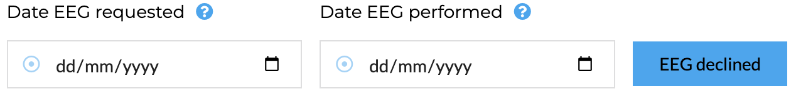
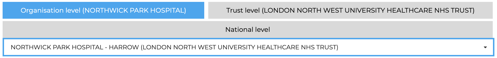
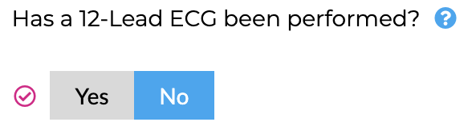
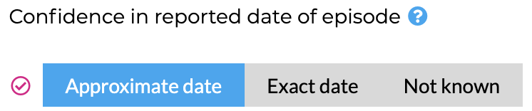
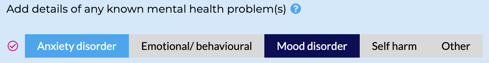
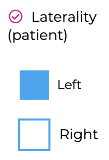
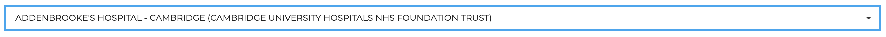
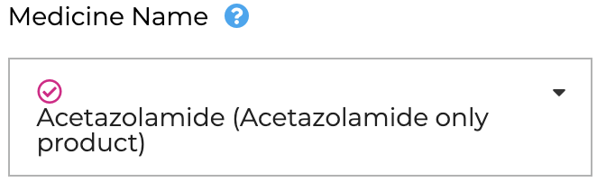

A specific design decision was made not to leverage the significant time-saving power of Django's class-based views and forms, in favour of HTMX, so some explanation is needed here to explain the rationale.

A criticism of the previous imagining of the Epilepsy12 audit, and the rationale to rebuild, was that it was too detailed and complicated. This meant users (largely clinicians) filling in the audit fields had significant audit fatigue completing the many screens of questions (which were verbose and detailed), with the consequence that many did not engage fully with the audit, or much of the information was incomplete. In planning therefore, the RCPCH Incubator development board and Epilepsy12 Project board teams agreed to reduce the burden on clinicians in 3 ways:

1. The Project Board to review all questions and remove any that were not essential to audit aims or key performance indicators. All fields would therefore be mandatory.
2. The Development Board to build 3 interfaces to Epilepsy12:
   1. An API interface either for automated population of some or all fields, particularly demographic information such as child's NHS number, name and postcode.
   2. A renewed frontend interface for clinicians to enter information easily if they were unable to use the API.
   3. A separate frontend interface for children and families to review all data held on them and their care, that they might be offered the opportunity to approve its accuracy and provide final consent to its inclusion in the audit. Whilst legally this is not needed, ethically it was felt important to offer this to families who were entrusting their data to be used to improve services for all.
3. The Design team together with the Development Board to ensure that any frontend application would be designed to be intuitive and navigable, that each entry be completed quickly and easily.

## Front End Design

RCPCH have a number of microsites on paediatric topics. To harmonise with the branding of these, Epilepsy12 was to adopt the branding of RCPCH to take advantage of the familiarity that existing users (many of whom are paediatricians) would already have with RCPCH resources.

### Reactivity

An important consideration for the Development Board was that any frontend application should therefore be reactive: Django applications typically require the user to complete multiple fields in a form before a submit button is pressed which POSTs the form contents to a form model instance for validation and then persistence in the data model. This is not reactive and this was felt to be counter to the stated aims of the project board that the forms be quick and easy to fill. It also makes it more difficult for different fields to be completed at different times throughout the audit year as different milestones were completed, allowing the user to fill the audit out in any order as things happened, without having to rely on all pieces of required information being present before form submission. This underlined the idea that audit is not linear, and no two children's epilepsy journeys are the same.

#### HTMX

[HTMX](https://htmx.org) is a small javascript library that uses allows the developer to access the DOM without writing javascript. The core of the library is that it allows the user to issue AJAX requests directly from HTML, facilitating server side rendering of partial html templates rather than triggering a page reload on submit.

This meant that Epilepsy12 views could receive individual POST requests for each field in the form and return small template partials allowing a save-as-you-go approach. Forms would be easy to customize and design, would be reactive, smooth and quick to complete for the user. The user should be able to save information at the time it is known and not be dependent on information required by different fields in the same models which might only be known at different times. For example, the MRI request date might be known before the date it has been reported, so the user should be allowed to record that date and record the report date later on. This would allow the user to complete fields not necessarily in order, but instead as things happened, and save all information immediately without having to submit a form and wait for the page to refresh with the new information. The downside was threefold:

- Class-based views and forms could not be used, since validation would have to be based on individual fields, not the full instance of the model.
- No fields in the model could be required to save a whole instance of the model.
- There needed to be a route for every question in the audit, with a corresponding function in ```views.py```

### Templates

Templates are all written in django-html. They are organized as follows:

- ```epilepsy12```: all templates in this folder relate to the Epilepsy12 application webapp
- ```registration```: all templates in this folder relate to signing in and signing up
- ```rest_framework```: this subclasses the ```api.html``` template used in the API webview.

Within the ```epilepsy12``` folder templates are organized according to the form they represent or some element of the form.

#### Blocks and Partials

These form a large part of the frontend design, since for the page to be reactive, it has to be broken into elements which can refresh without touching the rest of the DOM.

- ```base.html```: This forms the base of all content and is used as a parent template for most content. It includes the ```<head>``` tag and any javascript/jquery on which semantic ui is dependent.
- ```audit_section.html``` contains the structure of each form and has blocks within it for the text of the headers and footers which contain title, child identifiers if needed and basic information about form completion.
- ```partials```: This subfolder contains within it subfolders, one for each form. The form is broken up into partials which contain a single field or small number of fields which can be persisted and updated together.

#### ```page_elements```

This is a subfolder of ```partials``` and needs extra explanation, as this contains the customized widgets that make up the RCPCH audit forms. The widgets are named as follows:

| Page Elements |
:---------------|
| date_field.html |
||
| rcpch_multiple_toggle.html |
||
| toggle_button.html |
||
| single_choice_multiple_toggle_button.html |
||
| multiple_choice_multiple_toggle_button.html |
||
| checkbox_group.html |
||
| rcpch_organisations_select.html |
||
| select_model.html |
||

These are all Semantic UI elements, but have been customized to RCPCH design standards. Incomplete fields are rendered as blue round target icon next to the incomplete field, with a tooltip messaging this on hover, whilst completed fields are shown as pink ticks.

The parameters for the elements are not all the same but follow the same broad pattern:
*hx_post*: the url posted to including parameters
*hx_target*: the id of the html element to target the server response
*hx_trigger*: usually 'change' but can be any event
*label*: this is the label text (accessed from the help text in the model)
*reference*: this is the reference text (accessed from the help text in the model)
*date_value*: date value
*data_position*: this is the position of the popup label (js independent) ['top left', 'top center', 'top right', 'bottom left', 'bottom center', 'bottom right', 'right center', 'left center']
*input_date_field_name*: **date_field only** the name of the input element for the date_field - should match the field name being updated
*disabled*: a flag to reflect if the element is enabled or not
*hospital_list*: **hospital_select only** a filtered list of hospitals
*test_positive*: common to most of the elements. It is usually the name of the field in the model to be updated
*hx_field_list*: **check_box_group only** list of radiobutton options
*hx_field_list_name*: **check_box_group only** the name of the list of options
*hx_model*: **check_box_group only** model instance to update on selection
*tooltip_id*: **multiple_choice_multiple_toggle** id of the element for tooltip text

#### Other elements

The following partials are unique:

*steps.html*: This partial is the menu down the left of the screen which signals to the user which form they are interacting with, as well has how far through completion they are.
*registration_dates.html*: This partial is found in ```templates/epilepsy12/partials/registration/registration_dates``` and includes a ```date_field.html``` partial

These are both instances where the HTMX custom ```trigger``` function is used. This is where an element that is updated in one part of the screen leads to the update of another element in another part of the screen. This means the trigger to refresh the second element is sent in the header from the view to the template, and is triggered in the template. The ```steps.html``` element is updated each time any field in any form is updated. This is done in the view (in ```epilepsy12/view_folder/common_view_functions.py```) where the HTMX trigger (in this case ```'registration_active'```) is attached to the response as follows:

```python
# trigger a GET request from the steps template
    trigger_client_event(
        response=response,
        name="registration_active",
        params={})  # reloads the form to show the active steps
```

```'registration_active'``` is defined in ```views.py```. In this code snippet, the Registration and AuditProgress models are queried and passed on to the ```steps.html``` partial which is rerendered.

```python
# HTMX generic partials
def registration_active(request, case_id, active_template):
    """
    Call back from GET request in steps partial template
    Triggered also on registration in the audit
    """
    registration = Registration.objects.get(case=case_id)
    audit_progress = registration.audit_progress

    # enable the steps if has just registered
    if audit_progress.registration_complete:
        if active_template == 'none':
            active_template = 'register'

    context = {
        'audit_progress': audit_progress,
        'active_template': active_template,
        'case_id': case_id
    }

    return render(request=request, template_name='epilepsy12/steps.html', context=context)
```

The second place that custom HTMX triggers are used is in the ```confirm_eligible``` function of ```registration_views.py``` where the date of the first paediatric assessment can only be enabled once a primary audit site has been allocated and the user has confirmed the child meets all the eligibility criteria. In the same way, a custom HTMX trigger is attached to the response object:

```python
# activate registration button if eligibility and lead centre set
        trigger_client_event(
            response=response,
            name="registration_status",
            params={})  # updates the registration status bar with date in the client
```

The ```registration_status``` trigger calls the function of the same name in ```registration_views.py``` which returns the ```registration_dates.html``` partial with an updated instance of registration allowing the date fields to be enabled.

```python
@login_required
@group_required('epilepsy12_audit_team_edit_access', 'epilepsy12_audit_team_full_access', 'trust_audit_team_edit_access', 'trust_audit_team_full_access')
def registration_status(request, registration_id):

    registration = Registration.objects.get(pk=registration_id)
    case = registration.case

    context = {
        'case_id': case.pk,
        'registration': registration
    }

    template_name = "epilepsy12/partials/registration/registration_dates.html"

    response = recalculate_form_generate_response(
        model_instance=registration,
        request=request,
        context=context,
        template=template_name
    )

    return response
```

## Scores and Progress

User progress for each case is stored in the AuditProgress model which is updated each time a field is created or updated. The logic for this is common to all fields and therefore all logic is held in ```epilepsy12/view_folder/common_view_functions.py```.

There are several functions:

### Response generation

```python
def recalculate_form_generate_response(model_instance, request, context, template, error_message=None):
```

This receives a request and model instance from the calling view function with the context and the template and uses these to calculate which fields in the model have scored values (since all fields are initially ```None```), and compare this with the number of expected fields for that model instance. This is complicated by the fact that each form is dynamic, and therefore the total number of expected fields depends on user choices. For example, if the child is not eligible for epilepsy surgery, they do not have to complete date of referral and date seen at the local children's epilepsy surgery centre. There are several functions, therefore, that accept a model instance and use this to determine what the user has scored so far, and what the minimum expected number of fields should therefore be for a completed record. This progress is stored in the AuditProgress model which can be used to update the progress wheel in the ```steps.html``` partial as well as signal to the user if that form has been fully completed. It can also be used to know if all forms are complete and that the child's data can therefore be submitted.

Once progress calculations have been performed and the AuditProgress model has been updated, the response object can be constructed and the ```"registration_active"``` custom HTMX trigger discussed above can be attached before returning to the calling view function.

### Request validation and model updating

```python
def validate_and_update_model(
        request,
        model_id,
        model,
        field_name,
        page_element,
        comparison_date_field_name=None,
        is_earliest_date=None):
```

This function supercedes logic that was originally written as a decorator. Decorators are python functions which wrap another python function. They are typically used to protect routes to prevent unauthorized users gaining access and redirect them to the login or a 403 page.

Originally used in this way to reduce boiler plate code and update the model with the POST request value from the template, it soon became clear that it would not be possible in this way to return error messages to the template. The code was therefore moved here as a simple function to be called by most view functions to prevent code repeating.

It accepts a request, a model and model primary key, as well as the field name to be updated. If a date field is involved and some comparison of dates is needed, that is added an optional parameter. This then runs a validation on the POSTed data and updates the model with the new value. In the event of invalid data, the model is not updated and a ```ValueError``` is raised with a meaningful message which can be caught in the calling view function through the ```try...except...``` method and passed back to the template to be shown to the user.

Currently error messages largely exist for dates which are impossible (for example inappropriately in the future or where scans are reported before they have been requested), but in due course this will be extended to all errors beyond those that might be anticipated.

## API

The Epilepsy12 Team had originally envisaged an API to allow EHR to Audit communication to reduce the burden of field completion on clinicians and administrative teams. For EHRs nationally to integrate with an Epilepsy12 API for audit submission was not realistic for most trusts and the front end user interface remains the main way the audit will be completed. Django Framework has been added though to include some key endpoints to facilitate EHR to Epilepsy12 communication, particularly with respect of case addition.
In particular there are 2 endpoints that have been created:

1. ```api/v1/register_case```: accepts POST request of an NHS number of an existing case and hospital ID to register an existing case in Epilepsy12
2. ```api/v1/add_case_to_hospital_list```: accepts POST request of an NHS Number and HospitalID to create a record of a child in Epilepsy12, associated with a hospital

Other endpoints can be added in due course.
