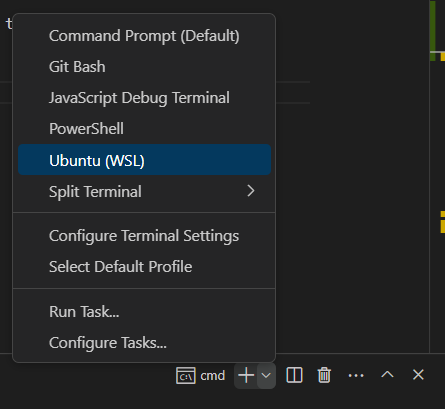

You should have already [downloaded Docker](https://docs.docker.com/get-docker/) and cloned the repository.

## Enabling the WSL Terminal within VS Code

There are scripts in the `s/` which streamline the setup for the development process. Unfortunately, Windows does not natively support running these through the Command Prompt. Instead, we must first install the **Windows Subsystem for Linux (WSL)** to run the scripts.

VS Code has a helpful extension to do just this!

Follow this guide ([Windows Subsystem for Linux VSCode Extension](https://code.visualstudio.com/docs/remote/wsl-tutorial)) to enable usage of a *Ubuntu (WSL)* terminal within VS Code.

## Running Scripts

Open a new WSL terminal by selecting it:



If you haven't already, `cd` into the root folder

```console
cd rcpch-audit-engine/
```

Finally, you should be able to run the setup script by typing:

```console
sh s/docker-up
```

!!! info "Setup errors"
    Sometimes, the easiest fix for many headaches, relating to installation and setup, is to simply restart your computer and try again!

## WSL <> Powershell <> Windows Caddy Certificate

Though WSL is required for the Docker setup, a few additional steps are needed related to [Caddy Certificates](https://caddyserver.com/docs/running#local-https-with-docker).

First, ensure all the Docker containers are running by running `sh s/docker-up` inside a WSL2 terminal, as described in the previous step.

To get the Caddy Certificate, open a Powershell terminal in the same directory. Powershell is required because the steps to install the Certificate are OS-specific, and we need the Windows installation.

Verify the containers are running and visible to PS. Open a PS terminal, **as an administrator**, navigate to the project folder and type:

```ps title="Powershell terminal"
docker compose ps
```

Which should result in something like:

```ps title="Powershell terminal"
NAME                                IMAGE                             COMMAND                  SERVICE             CREATED             STATUS              PORTS
rcpch-audit-engine-caddy-1          caddy                             "caddy run --config …"   caddy               27 minutes ago      Up 19 minutes       0.0.0.0:80->80/tcp, 0.0.0.0:443->443/tcp, 443/udp, 2019/tcp
rcpch-audit-engine-celerybeat-1     rcpch-audit-engine-celerybeat     "celery -A rcpch-aud…"   celerybeat          27 minutes ago      Up 19 minutes
rcpch-audit-engine-celeryworker-1   rcpch-audit-engine-celeryworker   "celery -A rcpch-aud…"   celeryworker        27 minutes ago      Up 19 minutes
rcpch-audit-engine-django-1         rcpch-audit-engine-django         "sh -c 'python manag…"   django              27 minutes ago      Up 19 minutes
rcpch-audit-engine-flower-1         rcpch-audit-engine-flower         "celery -A rcpch-aud…"   flower              27 minutes ago      Up 19 minutes       0.0.0.0:8888->8888/tcp
rcpch-audit-engine-mkdocs-1         rcpch-audit-engine-mkdocs         "sh -c 'mkdocs build…"   mkdocs              27 minutes ago      Up 19 minutes       0.0.0.0:8001->8001/tcp
rcpch-audit-engine-postgis-1        postgis/postgis:15-3.3            "docker-entrypoint.s…"   postgis             27 minutes ago      Up 19 minutes       5432/tcp
rcpch-audit-engine-redis-1          redis:alpine                      "docker-entrypoint.s…"   redis               27 minutes ago      Up 19 minutes       6379/tcp
```

Next, type:

```ps title="Powershell terminal"
docker compose cp caddy:/data/caddy/pki/authorities/local/root.crt %TEMP%/root.crt
```

Which will copy the `root.crt` from inside the `caddy` container into `%TEMP%`.

Finally, install the certificate by typing:

```ps title="Powershell terminal"
certutil -addstore -f "ROOT" %TEMP%/root.crt
```

Close and re-open Chrome, and everything should be working!